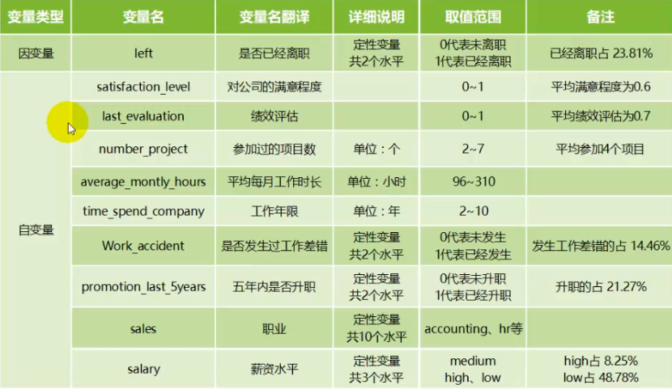
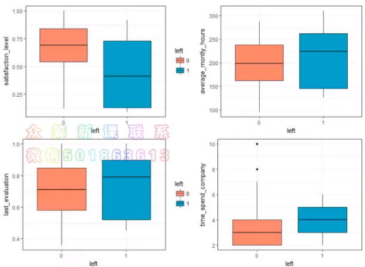

## 数据变量说明

【背景】：大公司想明白为什么优秀、有丰富经验的员工过早离职，以及预测哪一个有价值的员工将要离职。

### 变量说明

深刻理解数据，汇总一个数据描述表格[变量名称、详细说明、取值范围、备注]，建立模型

问题：所谓的“好”员工如何衡量？通过自变量的综合分析可以得到员工的好坏，是不是需要将员工经验高的挑选出来作为训练集，员工本身不太好的是不是不在题目要求的范围内呢？

- 【研究个体】：员工
- 【自变量】：[满意度、绩效评估、月均工作时长、工作年限、是否加班、......]
- 【因变量】：离职

### 描述性分析

- 对在整个数据集中的数据进行**统计量分析**【中位数、均值、第一分位数、第三分位数、最大值、最小值】
- 探索员工对公司满意度、绩效评估、月均工作时长、工作年限与离职的关系【箱线图】
- 探索参加项目的个数、五年内有没有升职和薪资与离职的关系

箱线图可以描述一个数据的中位数的一个变化。在每一个员工属性的影响下，因变量是否离职的情况图。

可以发现，已经离职的员工工作年限（4年左右）要比未离职的员工（3年左右）高一些的。

### 建模预测（交叉验证）

将所有离职的员工的信息分为测试集和验证集，此处就是用验证机对已经建立好的模型进行验证。

- 决策树
- 朴素贝叶斯

### 模型评估（预测）

预测尚未离职的员工是否会离职。

 https://blog.csdn.net/R3eE9y2OeFcU40/article/details/79585908 