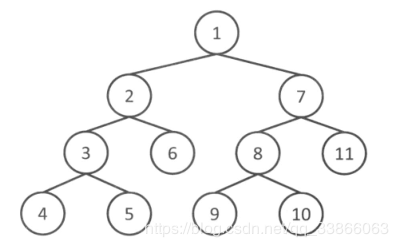

### 2.1.1 递归函数
1. **定义**：函数调用自身的行为。
2. **递归三要素**：
	\- 找到问题的了逻辑相似性 
	\- 找到合适的参数
	\- 递归的出口

比如斐波那契数列，一般的做法很简单[pyhton]
```python
   def fib(n):
        if n <= 1:
            return n
        return fib(n - 1) + fib(n - 2)
```
but，计算机白白多消耗了一些时间计算重复的东西。

so，解决办法就是设置一个数组，将F(1)~F(n-1)所有结果存起来【这就是动态规划的思想】[pyhton]
```python
max = 50
temp = [0 for i in range(1, max + 1)]
 def fib(n):
     if n <= 1:
         return n
     if temp[n] != 0:
         return temp[n]
     temp[n] = fib(n - 1) + fib(n - 2)
     return temp[n]
```
**完整程序：[C++]**
```C++
/*
斐波那契数列
用递归的思想实现，很简单
但是有很多计算是重复的 
考虑到动态规划的思想
将每一次算出来的结果用一个数组存储(记忆)
会减少计算时间 
*/
#include<iostream>
#include<cstdio>
using namespace std;
const int MAX_N = 100;
int a[MAX_N];

int f(int n){
	if(n<=1) return n;
	if(a[n]!=0) return a[n];
	return a[n] = f(n-1)+f(n-2);
}

int main(){
	int n;
	while(1){
		cin>>n;
		cout<<f(n)<<endl;
		memset(a, 0, sizeof(a)); // 循环调用一个公共变量，所以需要清空 
	}
	return 0; 
} 
```
### 2.1.2 栈和队列
**栈：FILO   队列：FIFO**
**简单实现[C++]**
```C++
/*
栈的简单push、pop
队列 
*/

#include<iostream>
#include<cstdio>
#include<stack> 
#include<queue> 

using namespace std;

int main(){
	stack<int> s;	// 需要声明栈中元素的数据类型 
	int size = 0; 
//	queue<int> s;
	s.push(1);
	s.push(2);
	s.push(3);
	size = s.size();
	for(int i = 0;i<size;i++){
		cout<<i<<"   "<<s.top()<<endl;	// stack中访问最底端数据 
//		cout<<s.front()<<endl;	// queue中访问最底端数据 
		s.pop();
	}	
	return 0;
}
/*
随着元素被pop出stack或queue，size也在减小，所以才不能弹出所有的元素 
所以，s.size()要在循环之前提前赋值给一个变量，而不能直接作为for循环的判断依据，所以，我增加了size变量 
*/
```
[python]没有封装好的栈和队列，所以可以使用list来代替。
一个属于类而非属于对象的方法。这就意味着我们可以将它定义为一个classmethod（类方法） 或是一个 staticmethod（静态方法） ，这取决于我们是否知道我们需不需要知道我们属于哪个类。
```python
class Stack:
    count = 0  # 类变量，用类名Stack调用

    def __init__(self):
        self.values = []
        Stack.count += 1  # 可以记录创建对象的数目

    def push(self, value): # value作为对象变量，用对象来调用
        self.values.append(value)

    def pop(self):
        return self.values.pop()

    def is_empty(self):
        return self.size() == 0

    def size(self):
        print(len(self.values))
        return len(self.values)

    def peak(self):
        return self.values[self.size() - 1]


if __name__ == '__main__':
    a = Stack()
    print(a.__dict__)  # 对象的内容的输出方式
    a.push(111)
    print(a.__dict__)
    a.size()
    print(a.peak())
    b = Stack()
    print(Stack.count)
```
```python
class Queue:
    def __init__(self):
        self.q = []

    def push(self, value):
        return self.q.append(value)

    def pop(self):
        self.q.pop(self.size() - 1)

    def size(self):
        return len(self.q)


q = Queue()
q.push(1)
q.push(2)
q.push(3)
q.push(4)
q.push(5)
print(q.size())		# 5
print(q.__dict__)	# {'q': [1, 2, 3, 4, 5]}
q.pop()
print(q.__dict__)	# {'q': [1, 2, 3, 4]}
```
### 2.1.4 深度优先搜索【DFS】
**基本思想**：从问题的一个状态出发，不断转移到下一个状态，直到找到最后一个状态，再依次返回，从别的路径再次向后面的状态转移，直至找到问题的解。用递归的思想容易求解。
**简单图示**：
图中结点的数字就是遍历的次序，该图指定从1结点出发，选择2、7中的一个，一般习惯从左边开始，所以选择2，继续选择2的子结点，所以选择了3，继续选择3的子结点，选择4。4没有子结点了，所以向4的上一级返回，返回至3，3的子结点还有5未被访问，所以选择5，同理，......

#### 第一题 

```C++
/*
DFS:
从给定起点出发，遍历图中所有的节点
采取递归的方法很简单 
**********************************
本体大意：
给定n个数字形成的数组a[n]，给定一个值k，
判断数组中的数字组合起来的和是否等于该值k 
限制条件：
n∈[1,20] 
a[i],k∈[-10^8,10^8] 
**********************************
解题思路：
这是一个相异元素不重复组合问题,从多种数列的组合中，判断和为k的组合方式是否存在。
总的排列数=C(n,0)+C(n,1)+...+C(n,n)=2^n 
也可以看作每一个数可以取，也可以不取，属于两种情况，所以总的选择数是2^n 
这可以想到构建一个二叉树，每一层就代表一个数a[i],左孩子右孩子分别代表取或不取 
通过DFS的思路解决 
*/ 
#include<cstdio>
#include<iostream> 
using namespace std;

const int MAX_N = 20;
int a[MAX_N];
int n,k;

bool dfs(int i,int sum){	// i表示所遍历过的元素的个数，也表示二叉树的层数 
	cout<<"pre i:"<<i<<"  sum:"<<sum<<endl; 
	if(i==n) return sum==k;	// 递归出口：i 已经到最后一层了，判断sum是否符合要求 
	if(dfs(i+1,sum)) return true;	// 执行下一层，不选a[i] 
	if(dfs(i+1,sum+a[i])) return true;	// 执行下一层，选择a[i] 
	cout<<"post  i:"<<i<<"  sum:"<<sum<<endl; 
	return false;
}

void solve(){
	if(dfs(0,0)) {
		cout<<"yes"<<endl;
	} else{
		cout<<"no";
	} 
}
int main(){
	cin>>n>>k;	// 先输入总数，再输入和，然后输入数组 
	for(int i =0;i<n;i++){
		cin>>a[i];
	}
	solve();
	return 0;
}
```
<font color=red>问题：如何输出路径呢？【未解决】</font>
#### 第二题

**解题思路**：
遍历园子数组，从‘w’点开始进行dfs，将'w'点换成‘.’，直到园子中没有'w'为止，所以dfs的次数就是水洼数。
8个方向共对应了8种状态转移，每个格子作为DFS的参数至多被调用一次，所以复杂度为O(8*N*M)=O(N*M)
**代码实现**：
```C++
/*
题目要求:
'w'表示积水，'.'表示陆地，要求水洼的个数。
八连通的积水被认为是连在一起的
input:
10 12 
w........ww.
.www.....www
....ww...ww.
.........ww.
.........w..
..w......w..
.w.w.....ww.
w.w.w.....w.
.w.w......w.
..w.......w.
output:
3
*/
#include<iostream>
using namespace std;

const int MAX_N = 20;
const int MAX_M = 20;

int N,M; // the length of the garden
char field[MAX_N][MAX_M+1]; 


void dfs(int x, int y){
	field[x][y] = '.';
	
	for(int dx = -1; dx <= 1; dx++){
		for(int dy = -1; dy <= 1; dy++){
			int nx = x + dx, ny = y + dy;
			if(nx >= 0 && ny >= 0 && nx < N && ny < M && field[nx][ny] == 'w'){
				dfs(nx,ny);
			}
		}
	}
}

void solve(){
	int res = 0;
	for(int i = 0; i < N; i++){
		for(int j = 0; j < M; j++){
			if(field[i][j] == 'w'){	// 遍历园子，找到‘水’点开始dfs 
				dfs(i, j);
				res++;	// 记录dfs的次数，即水洼数 
			}
		}
	}
	cout<<res;
}

int main(){
	cin>>N>>M;	// 园子大小 
	for(int i = 0; i < N; i++){
		for(int j=0; j<M; j++){
			cin>>field[i][j];	// 初始化园子 
		}
	}
	solve();	// 数水洼的个数 
	return 0;
}
```
### 2.1.5 广度优先搜索【BFS】
**基本思想**：从问题的一个状态出发，找到跟初始状态最接近的所有状态（初试状态需要一步可以到达的状态），遍历完之后，再遍历需要两步能够到达的状态，......
**简单图示**：
在下图中可以很容易看出，BFS相当于逐层遍历。


#### 第一题

```C++
/*
问题：
只能上下左右
要求步数最少 
input:
10 10
#S######.#
......#..#
.#.##.##.#
.#........
##.##.####
....#....#
.#######.#
....#.....
.####.###.
....#...G#
output:
22
*/
#include<queue>
#include<iostream> 
using namespace std;

const int INF = 100000000;
typedef pair<int,int> P;	// 表示结点坐标 
 
const int MAX_N = 20;
const int MAX_M = 20;
char maze[MAX_N][MAX_M];  // 迷宫
int N,M ;	
int sx,sy;	// 起点坐标 
int gx,gy;	// 终点坐标 
int dist[MAX_N][MAX_M];	// 记录距离的 

int dx[4] = {0,1,0,-1};	//	移动向量 [上右下左，顺时针方向]
int dy[4] = {-1,0,1,0};

// 求从(sx,sy)->(gx,gy)的min(dist) 
// 如果迷宫无解，贼返回INF 
int bfs(){
	queue<P> que;
	// dist 初始化 
	for(int i = 0; i < N; i++){
		for(int j = 0;j < M; j++){
			dist[i][j] = INF;
		} 
	}
	que.push(P(sx,sy));	// 先将源点装入队列 
	dist[sx][sy] = 0;	// 距离设为 0 
	
	while(que.size()){
		P p = que.front();que.pop(); // 初始结点 
		if(p.first == gx && p.second == gy)  break; //该结点已经是终点 ，跳出循环 
		// 四个方向循环
		for(int i = 0; i < 4; i++) {
			int nx = p.first + dx[i],ny = p.second + dy[i];
			if(nx >= 0 && nx < N && ny >= 0 && ny < M && maze[nx][ny] != '#' && dist[nx][ny] == INF){	// 判断是否有路可走 
				que.push(P(nx,ny));
				dist[nx][ny] = dist[p.first][p.second] + 1;
				cout<<"x:"<<nx<<" y:"<<ny<<"  dist:"<<dist[nx][ny]<<"    maze:" <<maze[nx][ny]<<endl; // maze怎么全是G？ 
			}
		}	
	}
	return dist[gx][gy];
}

void solve(){
	int res = bfs();
	cout<<res<<endl; 
}

int main(){
	cin>>N>>M;	// n*m
	for(int i = 0; i < N; i++){
		for(int j = 0; j < M; j++){
			cin>>maze[i][j];
			if(maze[i][j]=='S') {
				sx =i;sy=j;
			}
			if(maze[i][j]=='G'){ 	// 少了一个等号，全赋值成G了 
				gx=i;gy=j;
			}
		}
	}
	solve();
	return 0;
}
```
一失足成千古恨，错误输出，为什么会走那么多是#的点呢？原因是在标记G的坐标的时候，少写了一个等号，导致全部赋值成G：
4  4
S..#
.#.#
.#.#
.#.G
1 0  1
0 1  1
2 0  2
**1 1  2**
0 2  2
3 0  3
**2 1  3**
1 2  3
**0 3  3**
**3 1  4**
2 2  4
**1 3  4**
3 2  5
**2 3  5**
3 3  6
6
#### 书中原话摘抄：
宽度优先搜索中，只要**将已经访问过的状态用标记管理起来**，就可以很好地做到由近及远的搜索。这个问题中由于要求最短距离，不妨用d[N][M]数组把最短距离保存起来。初始时用充分大的常数INF来初始化它，这样尚未到达的位置就是INF,也就同时起到了标记的作用。

虽然到达终点时就会停止搜索，可如果继续下去直到队列为空的话，就可以计算出到各个位置的最短距离。此外，如果搜索到最后，d依然为INF的话，便可得知这个位置就是无法从起点到达的位置。

在今后的程序中，使用像INF这样充分大的常数的情况还很多。不把INF当作例外，而是直接参与普通运算的情况也很常见。这种情况下，如果INF过大就可能带来**溢出**的危险。

**深度优先搜索（隐式地）利用了栈进行计算，而宽度优先搜索则利用了队列。搜索时首先将初始状态添加到队列里，此后从队列的最前端不断取出状态，把从该状态可以转移到的状态中尚未访问过的部分加人队列，如此往复，直至队列被取空或找到了问题的解。通过观察这个队列，我们可以就知道所有的状态都是按照距初始状态由近及远的顺序被遍历的。**

**宽度优先搜索与深度优先搜索一样，都会生成所有能够遍历到的状态，因此需要对所有状态进行处理时使用宽度优先搜索也是可以的。但是递归函数可以很简短地编写，而且状态的管理也更简单，所以大多数情况下还是用深度优先搜索实现。反之，在求取最短路时深度优先搜索需要反复经过同样的状态，所以此时还是使用宽度优先搜索为好。**

### 2.1.6 特殊状态的枚举
	特殊的状态空间可以使用next_permutation函数，可以将n个元素生成n!种不同的排列方式。
	或者，通过位运算，枚举从n个元素中取出k个的C(n,k)种状态，即集合的所有子集 
	permutation 排列 

#### 从网上找了一道例题[ link](https://blog.csdn.net/foreverzili/article/details/79847505)
**描述**
小明十分聪明，而且十分擅长排列计算。比如给小明一个数字5，他能立刻给出1-5按字典序的全排列，如果你想为难他，在这5个数字中选出几个数字让他继续全排列，那么你就错了，他同样的很擅长。现在需要你写一个程序来验证擅长排列的小明到底对不对。
**输入**
第一行输入整数N（1<N<10）表示多少组测试数据，
每组测试数据第一行两个整数 n m (1<n<9,0<m<=n)
**输出**
在1-n中选取m个字符进行全排列，按字典序全部输出,每种排列占一行，每组数据间不需分界。如样例
**样例输入**
```
2
3 1
4 2
```
**样例输出**
```
1
2
3
12
13
14
21
23
24
31
32
34
41
42
43
```
```C++
#include<iostream> 
#include<algorithm>

using namespace std;

int n,r;
bool used[100];
int per[100];

// 测试用的函数
void print(char msg[]){
	cout<<msg; 
	for(int i =0;i<r;i++){
		cout<<per[i]<<" ";
	}
	cout<<endl;
}

// 从1 2 ... n 中选 r 个数 
void permutation(int pos) {
	if(pos == r) {
		for(int i = 0; i < pos; i++) {
			cout<<per[i];
		}
		cout<<endl;
		return ;
	}
		
	for(int i = 1; i <= n; i++)	{
//		cout<<"i:"<<i<<endl;
		if(!used[i]) {
			per[pos] = i;	// 保存结果等待输出 
			used[i]=1; 		// 把 i 标记为已使用 
//			print("pos:");
			permutation(pos+1);
//			print("pos+1:");
			used[i]=0;	// 递归调用结束后 i 状态复位 
		}
	}
}


int main(){
	int cas;
	cin>>cas;	// 测试数据的条数 
	while(cas--) {
		cin>>n>>r;	 
		permutation(0); // 从n中选取r个，全排列 ，因为r是全局变量，没有在函数中传参
	}
	return 0;
} 
```
看完之后，对于permutation的递归还是有点绕进去了。现在具体举例来理解一下。。
比如，从4个数中选取2个进行全排列，易知P(4,2)=12。

程序中指定pos=0作为起始排列的位置，(pos=0)≠r，执行for循环，i=1，used[1]=0(可以存)，将per[0]=1，used[1] = 1(已经占用)。

进入下一层递归，pos=1传入permutation函数中，判断pos不等于r，进入for循环，i=1，used[1]=1(已经占用);i++,i=2，used[2]=0(可以存),per[1]=2,used[2]=1(已经占用)。

进入下一层递归，pos=2传入permutation函数中，判断pos等于r，打印出per中的元素(即12)。

然后return 回到上一级递归，此时i=2,执行used[2]=0(清除占用标记)。继续执行for循环，i++,i=3,used[3]=0（可存）,per[1]=3【此时形成13】。。。依次递归，返回。
记住，递归是逐层返回，画个图慢慢就能想通了。
### 2.1.7 剪枝
顾名思义，穷竭搜索会把所有可能的解都检查一遍，当解空间非常大时，复杂度也会相应变大。

深度优先搜索时，有时早已很明确地知道从当前状态无论如何转移都不会存在解。

这种情况下，不再继续搜索而是直接跳过，这一方法被称作剪枝。

我们回想一下深度优先搜索的例题“部分和问题”。

在递归中只要sum超过k了，此后无论选择哪些数都不可能让sum等于k

所以此后没有必要继续搜索。
