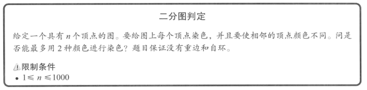
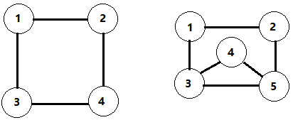
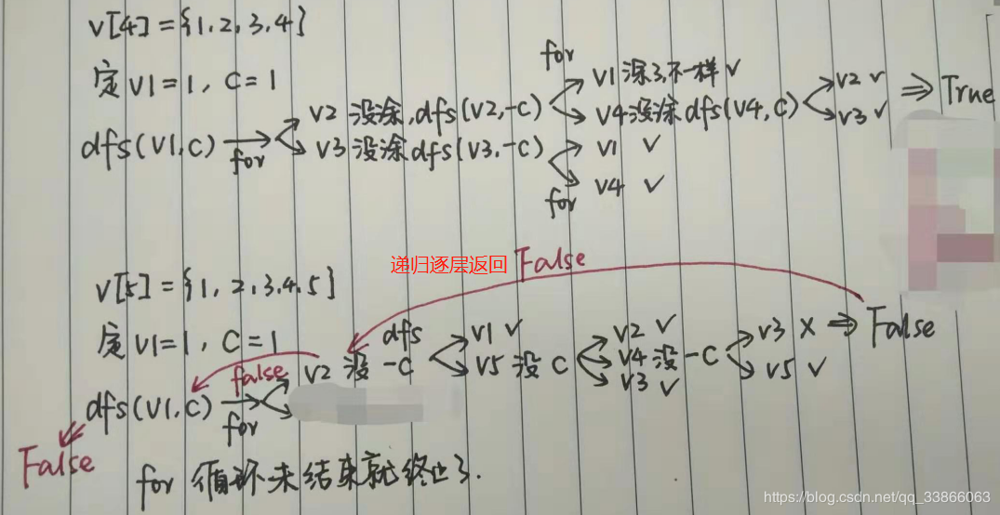
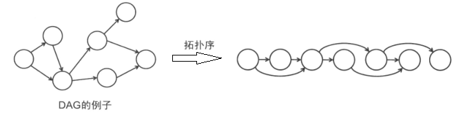
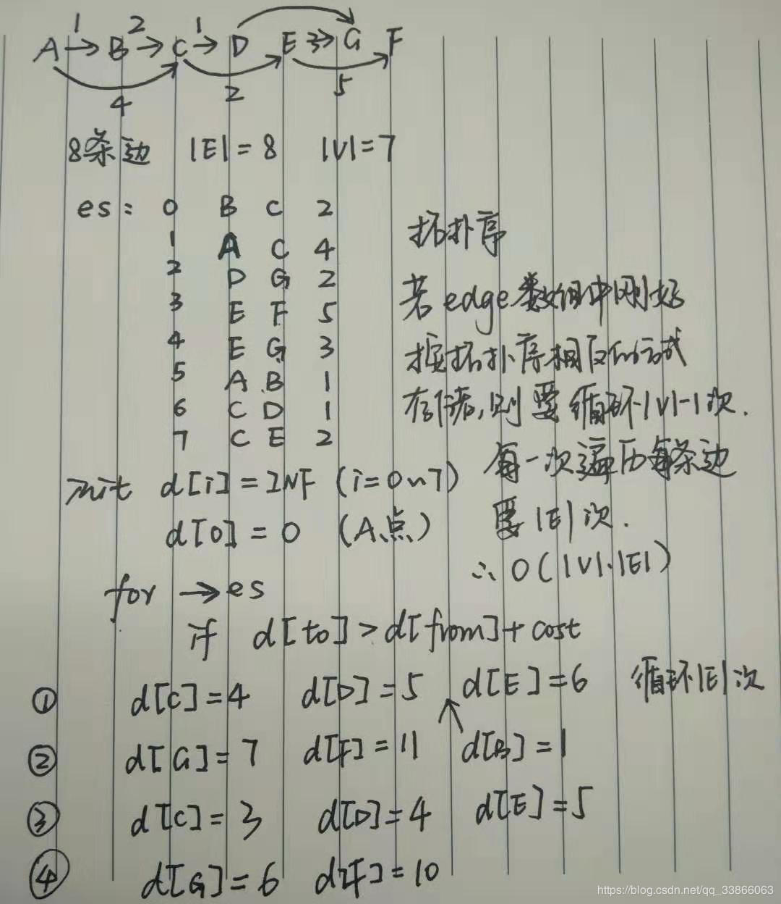
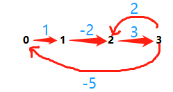
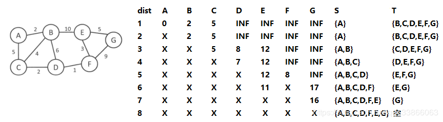

### 2.5 图论
DAG 没有圈的有向图
#### 2.5.3 图的搜索
本节提到了“二分图判定”这个题目。首先，我们先了解一下什么是<font color = red>二分图</font>呢？
&nbsp;&nbsp;&nbsp;&nbsp;&nbsp;&nbsp;&nbsp;&nbsp;给定一个图，给图中每一个结点涂上颜色，相邻结点的颜色不能相同，这就是<font color = red>图的着色问题</font>。对图进行染色需要的最小颜色数就称为<font color = red>最小着色数</font>。如果一个图仅仅需要两种颜色就可以满足相邻节点颜色不重复的情况，那么这个图就称作<font color = red>二分图</font>，也就是最小着色数是2。<hr/>
<font color = blue>解决思路：</font>
&nbsp;&nbsp;&nbsp;&nbsp;&nbsp;&nbsp;&nbsp;&nbsp;可以在纸上随机画一个简单的图，试着自己来涂色。先涂第一个点v1为红色，然后看和v1相邻的结点{v2,v3}，都不能涂成红色了，我们给他们涂上绿色，依次再观察{v2,v3}的相邻结点是否可以涂成红色，依次往下判断下去。


<font color = blue>代码实现：</font>
dfs,由于每一个点和边都访问了一次，所以复杂度是O(V+E)。dfs还可以求图的拓扑序。
```cpp
vector<int> G[MAN_V];							// 图 结点最多是 MAX_V 
int V;											// V个结点
int color[MAX_V]; 								// 标记每一个结点的颜色 

bool dfs(int v, int c) {
	color[v] = c; 	// 先将起点 v 染色成 c  
	for (int i = 0; i < G[v].size(); i++) { 	// 找 v 的邻接点
		// 判断该点有没有颜色
		if (color[G[v][i]] == c) return false;	// 已经涂色成c了，就直接返回不是二分图
		// 没有涂，就涂上-c ,进行dfs递归操作,如果递归返回上来的值是false，那也说明不是二分图 
		if (color[G[v][i]] == 0 && !dfs([G[v][i]], -c))  return false;	
	} 
	return true; 	// 都染过色了，而且没毛病，那么就说明是二分图咯
}
void solve() {
	for (int i = 0; i < V; i++) {	// 题目中没有说明是联通图，所以需要依次访问每一个结点，进行V次dfs
		if (color[i] == 0) {
			if (!fds(i, 1))	printf("no\n");
		}
	}
	printf("yes\n");
}
```
#### 2.5.4 最短路问题<font color = red></font>
<font color = red>最短路</font>是给定**起点**和**终点**，求出总长度最短的路径（长度就是途径的边的权值之和）
单源最短路径是固定一个点，如源点s，求该点到其余所有点的最短路径，其复杂度与求两点间最短路径相同。
##### <1>. 单源最短路径（Bellman-Ford算法）
<font color = blue>前提条件</font>：给定的图是DAG图，	使用拓扑序给顶点编号，通过递归关系求出d。
<font color = blue>递推关系</font>：记起点S到顶点i的最短距离为d[i]，两点间距离用dist[i][j]表示，那么d[i] = min{d[j] + dist[j][i]|e = (j,i)∈E}该等式成立。（DP）

&nbsp;&nbsp;&nbsp;&nbsp;&nbsp;&nbsp;&nbsp;&nbsp;以下是我模拟的例子，每一条边在edge数组中的存放顺序是随机的，按照Bellman算法的思想，用dist[i]标记是否源点到顶点i的最短距离，初始化时，只有源点的dist[i]是0，其余的都是INF。所以，首先需要找到源点充当起点的边，就需要循环|E|次。然而一次循环并不一定可以得到所有点的最短距离，所以在之前的循环外层还需要套上一层循环。设置一个标记变量，待dist[i]不再需要修改的时候，就说明已经找到了最短路径。


&nbsp;&nbsp;&nbsp;&nbsp;&nbsp;&nbsp;&nbsp;&nbsp;仔细思考一下，外层循环需要几次呢？可以看出来，这个次数和在数组中变得存放顺序有关。假设初始点是V0,在数组中存放时，将V0为起点的边在数组的前面，也就是按照拓扑序，这样依次可以得到V0到各个点的距离，这是最好的情况，一次循环就可以搞定；如果存放顺序刚好和拓扑序是反的，比如每次内层for循环找到最后一条边才发现起点是V0的，这种情况是最复杂的，需要|V|-1次while(true)循环。该算法的时间复杂度为O(V*E)
<font color = blue>代码实现：</font>
```cpp
struct edge {int from, to, cost; };	// 边的定义：起点、终点、权值
edge es[MAX_E];	// 存储图中众多边的数组
int dist[MAN_V]; // 源点到每一个点的最短路径长度
int V,E; // 顶点数，边数
// 源点S到其余点的最短距离
void shortest_path(int s) {
	for (int i = 0; i < V; i++) dist[i] = INF;	// 初始化为不可达
	dist[s] = 0; // 到本身的距离为0
	while (true) {
		bool update = false; // 是否继续更新的标志
		for (int i = 0; i < E; i++) {
			edge e = es[i];
			// 判断e.from是不是有距离了而且e.to这个点距离是不是该更新了
			if (dist[e.from] != INF && dist[e.to] > dist[e.from] + e.cost) {	
				dist[e.to] = dist[e.from] + e.cost;
				update = true;
			}
		}
		if (!update) break;
	}
}
```
Bellman算法的边可以是负权边的，但是不能有负圈。
那么，什么是负权边呢？什么是负圈呢？
<font color = red>负权边</font>：权重为负数的边。<font color = red>负圈</font>：总长度小于0的有向环路。
如下图就存在一个负环。

判断方法就是让外层循环在V-1次之后跳出，因为如果不存在负环的话，最短路不会经过同一结点两次。
```cpp
/*
Bellman_ford:
input:
4 5
0 1 1
0 2 2
1 2 2
1 3 2
2 3 3
output:
0点到第0个点的距离：0
0点到第1个点的距离：1
0点到第2个点的距离：2
0点到第3个点的距离：3
负环
input:
4 5 
0 1 1 
1 2 -2
2 3 3
3 2 2
3 0 -5
output:
无限循环,将原来的while修改为for，判断如果循环了v-1次说明存在负环，跳出
*/
#include <iostream>

using namespace std;

const int MAX_V = 100;
const int MAX_E = 100;
const int INF = 99999;
struct edge {int from, to, cost; };	// 边的定义：起点、终点、权值
edge es[MAX_E];	// 存储图中众多边的数组
int dist[MAX_V]; // 源点到每一个点的最短路径长度
int V,E; // 顶点数，边数

// 源点S到其余点的最短距离
void shortest_path(int s) {
	for (int i = 0; i < V; i++) dist[i] = INF;	// 初始化为不可达
	dist[s] = 0; // 到本身的距离为0
//	while (true) {
	for (int j = 0; j < V ; j++ ){
//		bool update = false; // 是否继续更新的标志
		for (int i = 0; i < E; i++) {
			edge e = es[i];
			if (dist[e.from] != INF && dist[e.to] > dist[e.from] + e.cost) {
				dist[e.to] = dist[e.from] + e.cost;
//				update = true;
			}
		}
//		if (!update) break;
		if (j == V-1 ) {cout<<"负环"<<endl;break;}
	}
}

int main(){
	cin>>V>>E;
	for (int i= 0;i<E;i++){
		int m,n,c;
		cin>>m>>n>>c;
		es[i].from = m;
		es[i].to = n;
		es[i].cost = c;
	}
	int s = 0;	// 起点
	shortest_path(0);
	for(int i = 0;i<V;i++){
		cout<<s<<"点到第"<<i<<"个点的距离："<<dist[i]<<endl;
	}
	return 0;
}
```
##### <2>. 单源最短路径（Dijkstra算法）
&nbsp;&nbsp;&nbsp;&nbsp;&nbsp;&nbsp;&nbsp;&nbsp;Bellman算法考虑了存在负权边的情况，如果d[i]还不是最短距离，那么即使进行d[j] = d[i] + (i,j)的更新，d[j]仍然不是最短距离，还需要跟随下一次d[i]的更新再更新。而且，即使d[i]一直不变，还是要检查从i作为起点的所有边，显然也很浪费时间。Then,来了DIjkstra算法：将所有结点分到两个集合中，已经确定最短路径的点存在S集合中，还没有确定的结点存在T集合中。然后就只需要找到T中每一个点的最短距离即可。
&nbsp;&nbsp;&nbsp;&nbsp;&nbsp;&nbsp;&nbsp;&nbsp;下图为算法图示，用X标记已经确定最短距离，INF是起点不可达的意思，用每一次确定的顶点更新该点可达的距离，然后从dist数组中选出最小的点放入S中，继续如此更新比较。

<font color = blue>代码实现：</font>
```cpp
/*
dijkstra算法：
input：边，结点数，S，dist
7 10
0 1 2
1 2 4
0 2 5
1 3 6
2 3 2
1 4 10
3 5 1
4 5 3 
4 6 5
5 6 9
output:结点访问顺序,最小距离
1   2
2   5
3   7
4   11
5   8
6   16
*/
#include <algorithm> 
#include <iostream>
using namespace std;

const int MAXN = 1000;

int cost[MAXN][MAXN]; // cost[i][j] 表示从i到j之间的权值，不存在该边时设为INF
int d[MAXN]; // 从起点到其他点的最短距离
bool used[MAXN]; // 确定点
int V,E; // 点的个数
const int INF = 1 << 30;	// 无穷大 

void Dijkstra(int s) {	// sourc
    fill(d, d + V, INF); // algorithm中的函数 将d数组全部赋为INF
    fill(used, used + V, false);
    d[s] = 0;	// 初始化，给定源点距离
    while(true) {
        int v = -1;	// 用来标记最小点的下标
        // 从未使用过的点!used[u]中取一个距离最小的点
        for(int u = 0; u < V; u++)
		// 如果u没有被标记过，而且u的距离比v小，就把u给了v。v标记的是距离最小的下标
        	if(!used[u] && (v == -1 || d[u] < d[v])) // u
				v = u;
        if(v == -1) break; // 所有的点的最短路径都确定了，则退出【作用类似与bellman的update】
       	used[v] = true;
        for(int u = 0;u < V;u++) { //更新以v为起点的边的权值
            d[u] = min(d[u], d[v] + cost[v][u]);
        }
    }
}

int main() {
	cin>>V>>E;	// point
	for (int i = 0; i < V; i++)
		for (int j = 0; j < V; j++)
			cost[i][j] = INF;
	for (int i = 0; i < E; i++){
		int m,n,c;
		cin>>m>>n>>c;
		cost[m][n] = c;
		cost[n][m] = c;
	}
	int s = 0; // source point
	Dijkstra(s);
	for(int i = 1; i < V; i++)	{
		cout<<i<<"   "<<d[i]<<endl;
	}
	return 0;
}
```
这个算法用邻接矩阵实现的图，算法复杂度为O(V^2)。在E比较小时，大部分时间用在了找顶点上，所以选择一个合适的数据结构对其进行优化。

需要优化的是**数值的插入（更新）**和**取出最小值**两个操作，用**堆**就可以了。每一次要从堆中取出的最小值就是下一次要用的顶点，堆中元素一共有V个，更新取出的次数为E次，算法复杂度为O(ElogV)。

使用priority_queue实现。
##### 任意两点最短路（Floyd算法）
#### 2.5.5 最小生成树<font color = red></font>
##### Prim
##### Kruskal
#### 2.5.6 应用