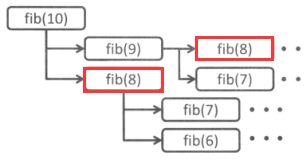

## 递归

递归：一个函数调用本身的行为

比如斐波那契数列，一般的做法很简单

```python
def fib(n):
    if n <= 1:
        return n
    return fib(n - 1) + fib(n - 2)
```

but，计算机白白多消耗了一些时间计算重复的东西。



so，解决办法就是设置一个数组，将F(1)~F(n-1)所有结果存起来

```python
max = 50
temp = [0 for i in range(1, max + 1)]
def fib(n):
    if n <= 1:
        return n
    if temp[n] != 0:
        return temp[n]
    temp[n] = fib(n - 1) + fib(n - 2)
    return temp[n]
```

