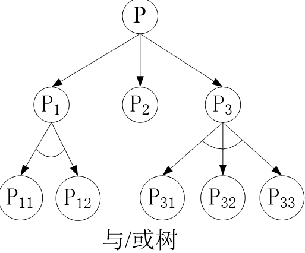
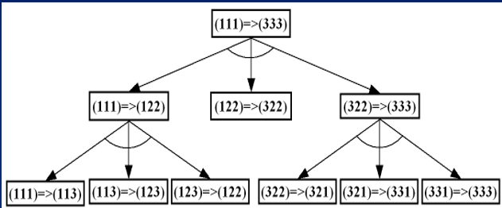
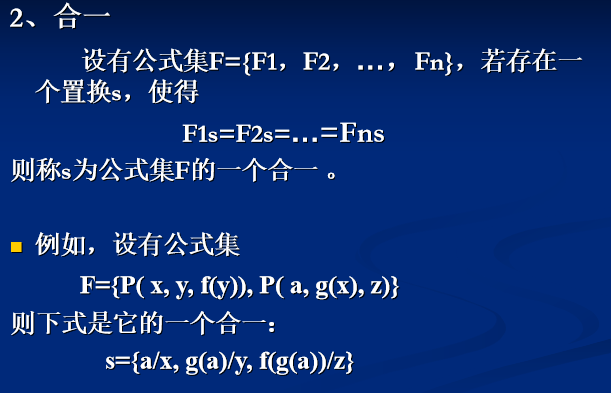
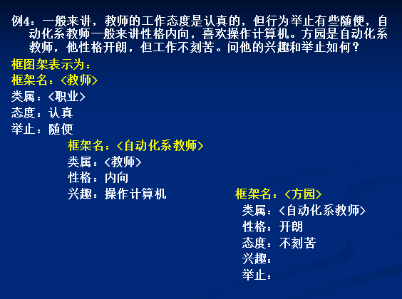
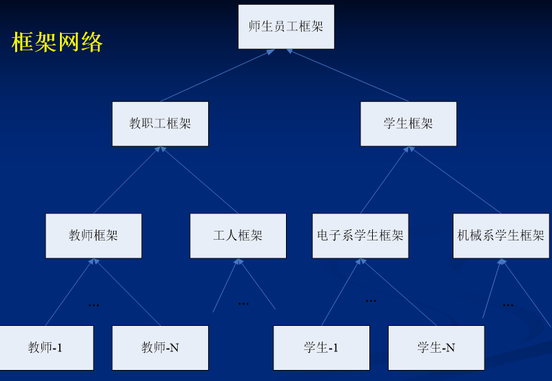

# 知识表示方法

【前提知识】

知识：相关信息关联在一起形成的信息结构。

知识表示：计算机可接受的描述知识的数据结构。

知识的范围：具体到一般；由说明到指定；确定到不确定

知识的划分：常识性知识、领域性知识；事实性知识、过程性知识、控制性知识；确定、不确定知识；逻辑性知识、形象性知识；显、隐性知识

人工智能---->a process to solve problem---->搜索过程

### 1.状态空间

表示问题：状态（解决问题的数据结构）、算符（状态转换的方法）、状态空间法

三元组（S,F,G）：初始状态集合S、操作符集合F、目标状态集合G

状态变量：$Q=[q_o,q_1,...,q_n]^T$

状态空间图：结点，弧线，有向图

要把所有的状态都表示出来，定义一组算符

### 2.问题归约

将问题变成一个子问题集合，子问题解的集合就是原问题的解。

包含：初始问题描述，一套将其变换成子问题的操作符，一套本源问题描述【分解(与)/等价变换(或)】

与或树：

终叶节点是可解节点。

汉诺塔：

### 3.谓词逻辑

谓词：连接两个个体之间的关系词/某一个个体的性质词

量词：全称量词 存在量词

谓词逻辑包含：变量、常量、函数

连词：合取、析取、蕴含

约束变量、自由变量

为了用谓词逻辑表示知识，首先要定义谓词【一个函数】

置换：用变元、常量、函数来代替变元，使该变元不在公式中出现。{$t_i/x_i$}，$t_i$和$x_i$不能相同，同时$x_i$不能循环出现在$t_j$中。比如：{g(y)/x,f(x)/y}不是代换；{g(a)/x,f(x)/y}是代换

合一：用置换s将公式集中对应的变元替换掉之后，公式集中每一项都是一样的。

### 4.语义网络

图表示：结点、弧【二元关系】

- 类属关系：Is-a、A-member-of、A-kind-of（张宇是个人，张宇$--is a->$person）
- 聚集关系：A-part-of（手是身体的一部分）
- 属性关系：Have、Can（我能洗衣服）、Owner(房子是我的，我$--owns->$房子$--owner->$我)
- 推论关系：fetch(A能推出B)
- 相近关系：Similar-to、Near-to
- 方位关系：Located-on/under/inside/outside/at（在上面/下面/里面/外面/位于）
- 时间关系：Before、After
- 构成关系：Composed-of

与谓词逻辑之间的相似之处，都可以相似的表示一个知识。

谓词逻辑：ISA（MAN，LIMING）或者MAN（LI MING）

语义网络：ＬＩＭＩＮＧ－－－ｉｓａ－－－>MAN

### 5.框架表示

用一个通用的框架表示已有经验，以数据结构存储

框架由描述事物的各个方面的槽组成，一个槽有多个侧面，一个侧面拥有多个值。

其实就是一个**类**叫做一个槽，一个槽的各个侧面表示的改类对应的属性值。

框架名/槽名/侧面值，也就是：类名/属性名/属性值

框架网络：更加抽象的类位于上层，稍微具体的类位于下层，下层指向上层。如下图：

### 6.剧本表示

剧本表示包括开场条件（前提条件）、角色（事件中可能出现的人物的一些槽，即属性）、道具（事件中可能出现的一些物体的槽）、场景（描述事件发生的真实顺序）、结果（事件发生以后产生的结果）。例如：餐厅吃饭

### 总结

【图示法、公式法、陈述法、过程式表示法】

- **状态空间法**是一种基于解答空间的问题表示和求解方法，它是以状态和操作符为基础的。在利用状态空间图表示时，我们从某个初始状态开始，每次加一个操作符，递增地建立起操作符的试验序列，直到达到目标状态为止。由于状态空间法需要扩展过多的节点，容易出现"组合爆炸"，因而只适用于表示比较简单的问题。
- **问题归约法**从目标(要解决的问题)出发，逆向推理，通过一系列变换把初始问题变换为子问题集合和子-子问题集合，直至最后归约为一个平凡的本原问题集合。这些本原问题的解可以直接得到从而解决了初始问题，用与或图来有效地说明 问题归约法的求解途径。 
- **谓词逻辑法**采用谓词合式公式和一阶谓词演算把要解决的问题变为一个有待证明的问题，然后采用消解定理和消解反演来证明一个新语句是从已知的正确语句导出的，从而证明这个新语句也是正确的。 
- **语义网络**是知识的一种图解表示，它由节点和弧线或链线组成。节点用于表示实体、概念和情况等，弧线用于表示节点间的关系。 
- **框架**是一种结构化表示方法。框架通常由指定事物各个方面的槽组成，每个槽拥有若干个侧面，而每个侧面又可拥有若干个值。大多数实用系统必须同时使用许多框架，并可把它们联成一个框架系统。
- **剧本**是框架的一种特殊形式，它使用一组槽来描述事件的发生序列。剧本表示特别适用于描述顺序性动作或事件，但使用不如框架灵活，因此应用范围也不如框架那么广泛。 

