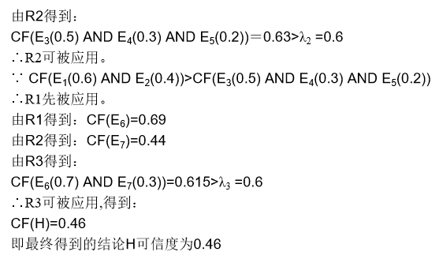

# 不确定性推理

重点：可信度方法、模糊推理

- 基本概念

- 概率方法

- 主观Bayes方法

- 可信度方法

- 模糊理论

- 简单模糊推理

  ---

【定义】：从不确定性的初始证据E出发，用不确定性的知识，推出一定程度上不确定的结论。即后面可信度方法中的，已知证据的可信度CF(E)，通过知识的可信度CF(E,H)，计算出结论的可信度CF(H)。

### 不确定性推理一般需要考虑的问题

1.【如何表示】：

- 知识不确定性：由领域专家给出的一个数值表示，称为静态强度
- 证据不确定性：也是一个数值，称为动态强度

2.【不确定性的匹配&阈值的选择】：

- 设计不确定性匹配算法
- 指定一个匹配阈值

3.【组合**证据**不确定性计算】：

由多条证据组合起来才可以得到结论时，需要对证据进行合成。

形如：IF $E_1$ AND $E_2$ THEN H 或者 IF $E_1$ OR $E_2$ THEN H

- 最大最小法：

  T( $E_1$ AND $E_2$ ) = min($T(E_1),T(E_2)$)

  T( $E_1$ OR $E_2$ ) = max($T(E_1),T(E_2)$)

- 概率法：

  T( $E_1$ AND $E_2$ ) = $T(E_1)\times{T(E_2)}$)

  T( $E_1$ OR $E_2$ ) = $T(E_1)+T(E_2)-T(E_1)\times{T(E_2)}$

- 有界法：

  T( $E_1$ AND $E_2$ ) = $max\{0,T(E_1)+T(E_2)-1\}$)

  T( $E_1$ OR $E_2$ ) = $min\{1,T(E_1)+T(E_2)\}$

- 注：该条是后加的，第一次看的时候觉得没什么用处，也没理解。T(E)可以表示证据为真的程度（动态强度），例如后面介绍的可信度方法中，就使用了最大最小法求解证据合成之后的可信度：CF( $E_1$ AND $E_2$)或者CF( $E_1$ OR $E_2$)

4.【不确定性的传递算法】

- 通过不确定性的证据和知识，计算结论的不确定性。

5.【结论不确定性的合成】

- 用不同**知识**进行推理得到相同的结论，每一条知识对应结论的不确定不同，需要一个合适的算法对**结论**的不确定性进行合成。

- 举例说明：

  R1=IF E1 THEN H（CF(H)=0.8）

  R2=IF E2 THEN H（CF(H)=0.3）

---

不确定性推理有很多种分类，此处主要讨论的是基于概率的方法，包括可信度方法和主观Bayes方法。

【不确定性的计算】：

经典概率方法：规则：IF E THEN H，条件概率P(H|E)可作为规则的静态强度。

先验概率：P(H)   后验概率：P(H|E)

贝叶斯公式：$P(H|E)=\frac{P(E|H)P(H)}{P(E)},其中P(E)=\sum{P(E|H_i)P(H_i)}$

$P(H|E_1,E_2)=\frac{P(E_1|H)P(E_2|H)P(H)}{P(E)},其中P(E_1E_2)=\sum{P(E_1|H_i)P(E_2|H_i)P(H_i)}$

由于概率推理方法存在一些现实局限，所以主观贝叶斯方法表示知识：IF E THEN (LS,LN) H。

【不确定性的更新】：

【不确定性的合成】：

【主观贝叶斯公式】$IF.E.THEN.(LS,LN) H(P(H))$

$P(H|E)=\frac{P(E|H)P(H)}{P(E)}$

$P(notH|E)=\frac{P(E|notH)P(notH)}{P(E)}$

LS是充分性度量：$LS=\frac{P(E|H)}{P(E|notH)}$，指出E对H的支持程度

LN是必要性度量：$LN=\frac{P(notE|H)}{P(notE|notH)}$

$\Theta(H|notE)=\frac{P(H|notE)}{P(notH|notE)}$

【该分界线内的应该不考/(ㄒoㄒ)/~~】

---

###可信度的计算

【可信度】：根据经验对一个事物和现象为真的相信程度。

- 在可信度方法中，由专家给出规则或知识的可信度，从而避免求先验概率或条件概率。即CF(H,E)该数值是给定的

- CF模型：IF E THEN H (CF(H,E))，其中，可信度因子/规则强度：CF(H,E)$\in[-1,1]$

- CF(H,E)>0 则P(H|E)>P(H); CF(H,E)<0 则P(H|E)<P(H);CF(H,E)=0 则P(H|E)=P(H)可以理解为：在证据的条件下，结论发生的概率比结论本身发生的概率要大，说明这条规则/知识是有一定可信度的；反之，如果在证据的条件下，概率变小了，说明这一条知识不可信，所以可信度是负的。

- CF(H,E)=MB(H,E)-MD(H,E)，其中MB,MD分别表示证据对结论有利和无利的一面，称为信任/不信任增长度。

- 定义:

  $MB(H,E)=\begin{cases}1,P(H)=1 \\ \frac{max(P(H|E),P(H))-P(H)}{1-P(H)},否则\end{cases}$

  $MD(H,E)=\begin{cases}1,P(H)=0 \\ \frac{min(P(H|E),P(H))-P(H)}{-P(H)},否则\end{cases}$

  $CF(H,E)=\begin{cases}MB(H,E)-0=\frac{P(H|E)-P(H)}{1-P(H)},P(H|E)>P(H) \\ 0\qquad\qquad\qquad\qquad\qquad\qquad,P(H|E)=P(H) \\0-MD(H,E)=\frac{P(H)-P(H|E)}{P(H)},P(H|E)<P(H)\end{cases}$

※ 关于CF(H,E)的具体计算应该不需要学的太细，毕竟CF(H,E)是专家给定的数值，题目中会给定的。

【组合证据的不确定性】

- 可采用最大最小法
  若E=E1 AND E2 AND…AND En,则CF(E)=**min**{CF(E1),CF(E2),…,CF(En)}
  若E=E1 OR E2 OR…OR En,则CF(E)=**max**{CF(E1),CF(E2),…,CF(En)}

【证据的不确定性】用可信度因子表示，动态强度：CF(E)>0：某种程度上证据为真；CF(E)<0：某种程度上证据为假。

【结论H的可信度-不确定性的传递算法】$CF(H)=CF(H，E)\times{max\{0,CF(E)\}}，CF(H)\in[-1,1]$

【结论不确定性的合成算法】同一个结论可以有多条不同的知识推出来。

【结论H的综合可信度】：

1. 对每一条知识求$CF_i(H)$

2. 求$CF_{12}(H)=\begin{cases}CF_1(H)+CF_2(H)-CF_1(H)×CF_2(H),both>=0 \\CF_1(H)+CF_2(H)+CF_1(H)×CF_2(H) ,both<0\\\frac{CF_1(H)+CF_2(H)}{1-min{|CF_1(H)|,|CF_2(H)|}},二者异号\end{cases}$

3. 必考题

   

---

以上区域内是可信度方法中的通用模型，下面学习几个特殊的，含(知识的)阈值的和(证据的)加权的：

【带有阈值限度的不确定性推理】CF(H,E),$\lambda$

当CF(E)>=λ时，知识才可以被应用，CF(H)=CF(H,E)×CF(E)；在通用模型中相当于$\lambda=0$，也就是CF(E)>0的才会被采用，CF(E)<0时就会被舍弃。

【结论不确定性的合成算法】

1. 当n条规则/知识都满足$CF(E_i)>=\lambda,i=1,2,...,n$时，计算$CF_i(H)$
2. 求综合可信度
   - 极大值法：$CF(H)=max\{CF_1(H),CF_2(H),...,CF_n(H)\}$
   - 加权求和法：$CF(H)=\frac{1}{\sum{CF(H,E_i)}}\sum\{CF(H,E_i)×CF(E_i)\}$
   - 有限和法：$CF(H)=min{(\sum{CF_i(H)},1)}$
   - 递推法：$C_1=CF(H,E_1)×CF(E_1),C_k=C_{k-1}+(1-C_{k-1})×CF(H,E_k)×CF(E_k)$

【加权的不确定性推理】

知识表示：IF $E_1(\omega_1)ANDE_2(\omega_2)AND...ANDE_n(\omega_n)$ THEN H $(CF(H,E),\lambda)$

其中，$\omega_i\in[0,1]$是加权因子，$\lambda$是阈值，都由专家给出。$\sum{\omega_i}=1$

组合证据的可信度：$CF(E)=\frac{1}{\sum{\omega_i}}\sum{(\omega_i×CF(E_i))}$

【前提条件中带有可信度因子的不确定性推理】

###【模糊推理】