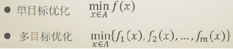
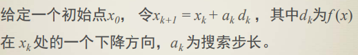
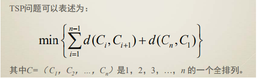
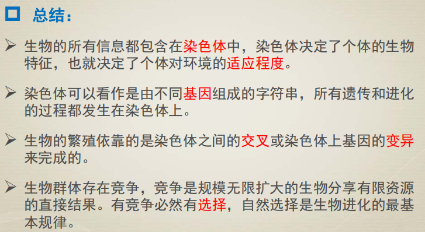
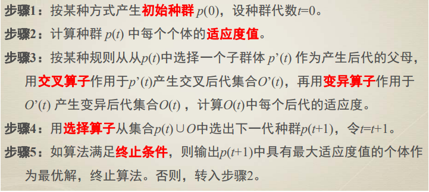
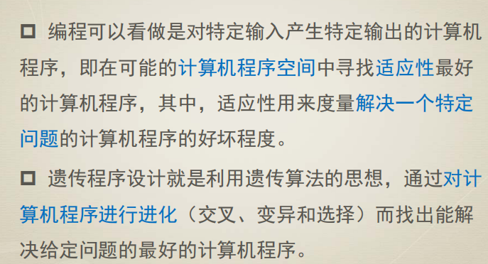

# 进化算法基础

老师：王晓丽副教授

Evolutionary Algorithm 32学时，2学分，作业20+考勤10+考试70

## 1.什么是优化？optimization

To make sonthing better.

• Optimization is the selection of a best element (with regard to some criterion) from some set of available alternatives.
• In the simplest case, an optimization problem consists of maximizing or minimizing a real function by systematically choosing input values from within an allowed set and computing the value of the function. 
• More generally, optimization includes finding "best available" values of some objective functions given a defined domain (or input), including a variety of different types of objective functions and different types of domains.

在可行域中找出满足目标任务的最好解。

## 2.接触过什么优化方法？

传统意义上的优化方法，通过求导得出最大值或最小值。

如考虑的最优解，迭代步骤是：

不同的dk可以产生不同的算法，比如：

牛顿法、最速下降法、......(然而他们都要用到求导)

**优点：**收敛速度快；效率高

**缺点：**有些问题没有办法写出函数表达；需要用到函数的导数，难以求出全局最优解；或者求导不容易或者不能得到实际问题的解。

such as:

#### TSP问题：

将出发的城市固定，一共有(n-1)!中可能的解。

## 3.生活中什么是被engineer优化的东西？

飞机机翼；路径规划（物流、铁路、红绿灯）；搜索；翻译；自动驾驶

## 4.进化算法

研究原理：模拟生物进化和遗传原理（随机搜索）

研究对象：一群点的移动（通过进化算子）

研究条件：要计算适应度函数

注意：个体的进化未必是优化算法的结果，优化算法的目的是整个群体的进化。

**优点：**适合解决非线性复杂优化问题、不需要函数可微可导、离散问题、组合优化的问题、非凸优化函数；不容易陷入局部最优解；对于np难问题，能在较短时间内找到最优解。

**缺点：**不适合对于实时性要求比较强的问题；约束条件中等式太多不太适用（强约束条件）

####达尔文的进化论：

在**资源有限、种群稳定**的世界中，有**优良性状**的个体会更容易获得**生存和繁衍**的机会。在幼年生物体发育过程中，随机事件会导致生物性状的随机改变（**变异**），如果能够更好地适应环境就会被保留，反之，就会被淘汰。

#### 孟德尔：

生物体通过遗传基因将性状独立的遗传给后代。

进化的过程：繁殖，变异，竞争，选择

### 研究分支：

- 遗传算法 Genetic Algorithm, GA【by染色体中的gene交叉变换】
- 进化策略 Evolution Strategies, ES【变异，选n个最好的】
- 进化规划 Evolution Programming, EP【竞赛选择】
- 遗传程序设计 Genetic Programming, GP

####算法框架：

- 产生**初始种群**p(0)={x1,x2,...,xN}，令t=0(第0代)【编码】
- 计算每一个**个体的适应度**来评价个体的优劣
- 使用**进化算子**产生新一代种群p(t+1)，令t++
- **终止条件**成立，stop；否则，转step2

####生物学中的遗传：

在繁殖下一代时，两个染色体通过**交叉重组**（DNA的交叉重组）；细胞复制的时候，又会发生某种小概率的**变异**，产生新的染色体遗传给后代。**适应度**高的个体就会被**自然选择**出来。

###遗传算法：

编码（种群）->适应度->交叉->变异->选择

### 进化策略：

1. 选取μ个个体组成初始群体

2. (μ+1):随机选取一个个体用**正态分布**变异的到一个后代，Δx~N(0,1)

   (μ+λ) (μ,λ)：选取λ对个体，**交叉**产生λ个后代，将每一个后代**变异**得到新的后代

3. (μ+1):后代代替种群中最差的个体得到下一代群体。

   (μ+λ):从（μ+λ）中选取μ个最优个体作为下一代。迭代

    (μ,λ):在新产生的λ中选出μ个最优者作为下一代 (λ > μ)。迭代

###进化策略与遗传算法的区别？
 遗传算法以**交叉**作为主要的进化算子，而进化策略以**变异**作为主要进化算子。
 进化策略主要用于求解数值优化问题。近来，遗传算法也用实数编码来求解数值优化问题，两者相互渗透已使得它们没有明显的界。

## 进化规划：

1. 随机产生 **初始群体**
2. 确定的一个分布，使群中所有个体**变异**，得到新群体
3. 算每个个体的**适应度**，随机竞赛**选择**选出下一代群体。【随即竞赛：每次随机选出k个，将其中适应度最好的放入下一代，直到选够为止】

### 进化规划与进化策略的区别？
 进化规划通过竞赛使用随机选择，而进化策略用确定性选择来抛弃最差的解。
 进化规划不用交叉算子产生后代，只用变异，且当解越来越逼近最优解时，变异的程度越小，而进化策略通常使用交叉算

## 遗传程序设计：

