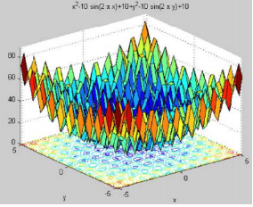

# 进化算法基础

老师：王晓丽副教授

Evolutionary Algorithm 32学时，2学分，作业20+考勤10+考试70

## 1.什么是优化？optimization

To make sonthing better.

• Optimization is the selection of a best element (with regard to some criterion) from some set of available alternatives.
• In the simplest case, an optimization problem consists of maximizing or minimizing a real function by systematically choosing input values from within an allowed set and computing the value of the function. 
• More generally, optimization includes finding "best available" values of some objective functions given a defined domain (or input), including a variety of different types of objective functions and different types of domains.

在可行域中找出满足目标任务的最好解。

- 单目标优化：minf(x),x∈A

- 多目标优化：min{f1(x),f2(x),...,fn(x)}，x∈A

## 2.接触过什么优化方法？

传统意义上的优化方法，通过求导得出最大值或最小值。

如考虑minf(x)，x∈D的最优解，迭代步骤是：

​		给定一个初始点X0，令Xk + 1 = Xk + akdk，其中dk是f(x)在Xk处的一个下降方向， ak为搜索步长。

不同的dk可以产生不同的算法，比如：**牛顿法、最速下降法**、......(然而他们都要用到求导)

**优点：**收敛速度快；效率高

**缺点：**有些问题没有办法写出函数表达；需要用到函数的导数，难以求出全局最优解；或者求导不容易或者不能得到实际问题的解。

进化算法就是为了克服传统优化方法的缺点而设计的一类算法。它研究的问题是：函数的导数不存在或无法求得，要求函数的全局最优解的问题。它是对传统优化方法的一种**补充**，而不是替代 。

such as:

#### TSP问题：

将出发的城市固定，一共有(n-1)!中可能的解。

可表述为：min{Σ(i=1~n-1)d(Ci, Ci+1) + d(Cn,C1)}	其中C是全排列

## 3.生活中什么是被engineer优化的东西？

飞机机翼；路径规划（物流、铁路、红绿灯）；搜索；翻译；自动驾驶

## 4.进化算法

研究原理：模拟生物进化和遗传原理（随机搜索）

研究对象：一群点的移动（通过进化算子）

研究条件：要计算适应度函数

注意：个体的进化未必是优化算法的结果，优化算法的目的是整个群体的进化。

**优点：**适合解决非线性复杂优化问题、不需要函数可微可导、离散问题、组合优化的问题、非凸优化函数；不容易陷入局部最优解；对于np难问题，能在较短时间内找到最优解。

**缺点：**不适合对于实时性要求比较强的问题；约束条件中等式太多不太适用（强约束条件）

####达尔文的进化论：

在**资源有限、种群稳定**的世界中，有**优良性状**的个体会更容易获得**生存和繁衍**的机会。在幼年生物体发育过程中，随机事件会导致生物性状的随机改变（**变异**），如果能够更好地适应环境就会被保留，反之，就会被淘汰。

#### 孟德尔：

生物体通过遗传基因将性状独立的遗传给后代。

进化的过程：繁殖，变异，竞争，选择

### 研究分支：

- 遗传算法 Genetic Algorithm, GA【by染色体中的gene交叉变换】
- 进化策略 Evolution Strategies, ES【变异，选n个最好的】
- 进化规划 Evolution Programming, EP【竞赛选择】
- 遗传程序设计 Genetic Programming, GP

####算法框架：

- 产生**初始种群**p(0)={x1,x2,...,xN}，令t=0(第0代)【编码】
- 计算每一个**个体的适应度**来评价个体的优劣
- 使用**进化算子**产生新一代种群p(t+1)，令t++
- **终止条件**成立，stop；否则，转step2

####生物学中的遗传：

- 在繁殖下一代时，两个染色体通过**交叉重组**（DNA的交叉重组）；

- 细胞复制的时候，又会发生某种小概率的**变异**，产生新的染色体遗传给后代。

- **适应度**高的个体就会被**自然选择**出来。

**总结：**

- 生物的所有信息都包含在**染色体**中，染色体决定了个体的生物特征，也就决定了个体对环境的**适应程度**。
- 染色体可以看作是由不同**基因**组成的字符串，所有遗传和进化的过程都发生在染色体上。
- 生物的繁殖依靠的是染色体之间的**交叉**OR染色体上基因的**变异**来完成的。
- 生物群体存在竞争，**竞争**是规模无限扩大的生物分享有限资源的直接结果。有竞争必然有**选择**，自然选择是生物进化的最基本规律。

###🌳遗传算法GA：<主要靠交叉来遗传，pc较大>

编码（种群）->适应度->交叉->变异->选择

步骤1：按某种方式产生**初始种群**p(0)，设种群代数=0。
步骤2：计算种群p()中每个个体的**适应度值**
步骤3：按某种规则从从p(t)中**选择**一个子群体p'(t)作为产生后代的父母，用**交叉**算子作用于p'(t)产生交叉后代集合O'(t)，再用**变异**算子作用于O'(t)产生变异后代集合O(t)，计算0()中每个后代的**适应度**。
步骤4：用**选择算子**从集合p(t)∪O中选出下一代种群p(t + 1)，令t = t + 1。
步骤5：如算法满足**终止条件**，则输出p(t + 1)中具有最大适应度值的个体作为最优解，终止算法。否则，转入步骤2。

### 🌳进化策略ES：<靠个体变异来进化，pm较大>

1. 初始化一个含有μ个个体的种群；

2. (μ+1)：随机选取一个个体xi用**正态分布变异**得到一个后代x'i = xi + Δx，其中Δx~N(0,1)

   (μ+λ)：选取λ对个体，**交叉**产生λ个后代，将每一个后代**变异**得到新的后代

   (μ, λ)：同上

3. (μ+1)：用这个后代代替种群中最差的个体，得到下一代群体。N

   (μ+λ)：从(μ+λ)中选取μ个最优个体作为下一代。迭代	2N

   (μ,λ)：在新产生的λ中选出μ个最优者作为下一代 (λ > μ)。迭代

###进化策略与遗传算法的区别？
- GA以**交叉**作为主要的进化算子，而ES以**变异**作为主要进化算子。
- 进化策略主要用于求解**数值优化**问题。近来，遗传算法也用实数编码来求解数值优化问题，两者相互渗透已使得它们没有明显的界限。

### 🌳进化规划 Evolution Programming【EP】：

1. 随机产生**初始群体**
2. 确定一个分布，使群中所有个体按照分布**变异**，得到新群体
3. 算每个个体的**适应度**，随机竞赛选择选出下一代群体。【随机竞赛：每次随机选出k个，将其中适应度最好的放入下一代，直到选够为止】

### 进化规划与进化策略的区别？
- 进化规划通过竞赛使用**随机选择**选最优的，而进化策略用**确定性选择**抛弃最差的解。
- 【EP】**不交叉只变异**，且当解越来越逼近最优解时，变异的程度越小；而【ES】通常使**用交叉**

### 🌳遗传程序设计【GP】：

GP是离用GA的思想，通过对计算机程序进行进化，找出最好的解决问题的计算机程序。

即，GP的输入和输出都是一段计算机程序。

## ❤相关的参考算法和期刊❤：

 PSO：Particle Swarm Optimization **粒子群优化** • ACO：Ant Colony Optimization **蚁群优化** • CAs：Cultural Algorithms **文化算法** • ICA：Immune and colon Algorithms **免疫与克隆** • DE：Differential Evolution **差分进化** • Co-evolution Algorithms **协同进化** • Decomposition-based Algorithms 基于分解的算法 • 其他：如Fish Swarm等 

 • 《IEEE Transactions on Evolutionary Computation》 

• 《 Evolutionary Computation》 

• 《Swarm and Evolutionary Computation》

 • 《Artificial Intelligence》 

• 《Applied soft computing》 

• 《Soft computing》 

