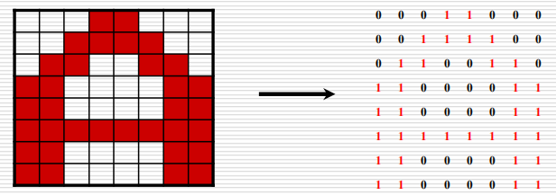
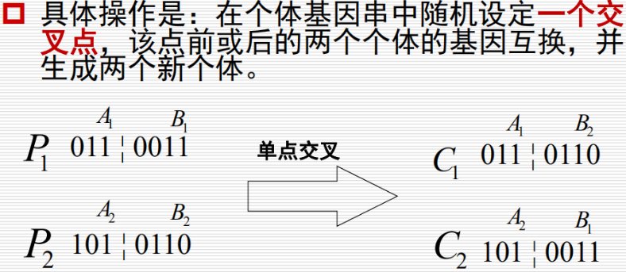
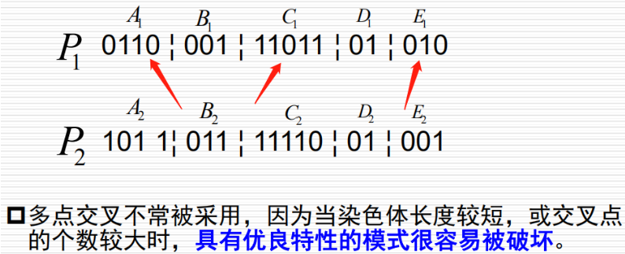
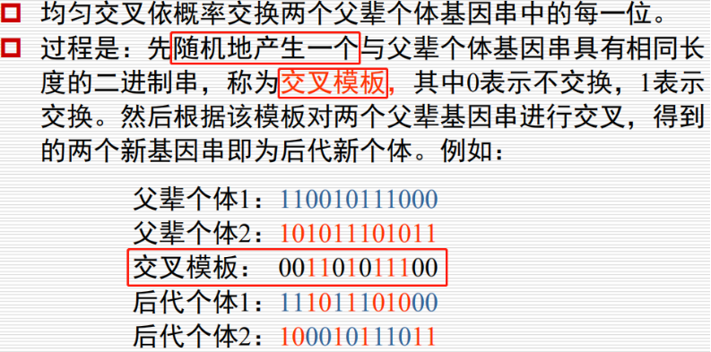
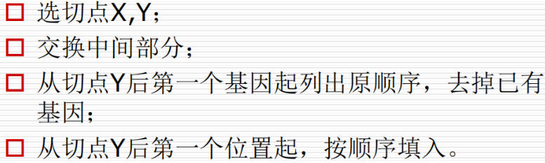
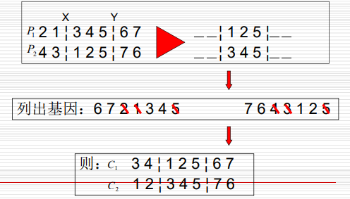
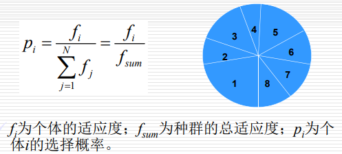
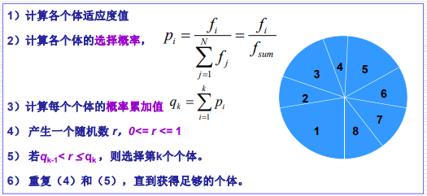
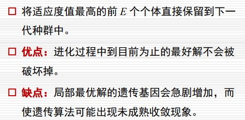

# 遗传算法

###一、编码&解码、适应度

chromosome/individual包括多个gene位

- 编码决定了个体基因的排列形式，从而决定了**选择、交叉及变异**的方式
- 编码决定了搜索的**困难度与复杂性**
- 编码决定了问题的**求解精度**

####适应度函数：

- 取正值
- x（个体）越好，适应度值越大
- 

####二进制编码、解码

##### 例题：函数f(x)=x^2, 其自变量x在区间[0，31] 取整数值，求该函数的最大值。【使用进化算法求解】

解：

step0：随机产生N个个体**构造种群**p(0)。【方法：由题意，需要5个二进制位，对每一位生成(0,1)之间的随机数k，若k∈[0,0.5)将gene位置0；否则将基因位置1】如，01101 11000 01000 10011四个个体	

step1：**适应度计算**，对于本题目原函数就是一个正函数，所以可以将其作为适应度函数来计算。计算结果是选择适应度最好的个体，即11000

##### 多参数二进制编码

解决方法：对每一个参数按照其取值范围进行编码，顺序连接起来既可作为一个个体。

如，

#### 整数编码

TSP问题，如1->4->3->6->5->2->7->1

- 近邻表示：code:（4，7，6，3，2，5，1）【第1~7的下一个地点序号】decode:同理
- 次序表示：code:(1,3,2,3,2,1,1)【一般选择一个参考序列，如(1,...,n)。编码的号码为每一个位在参考序列的次序，并且将每一位编完码从参考序列中删掉，再对下一位进行编码】decode:几乎一致，就是一个反过程，仍然要从参考序列中一个一个删除。

####二维编码

###二、交叉

 **单点交叉**

 **两点交叉**!

 **多点交叉**

 **均匀交叉**

 **部分匹配交叉**

适合于**整数编码**方式，每一个基因位的数字不允许相同。选择两个交叉点，对中间部分进行交换，同时需要弥补其他位可能重复的麻烦，所以需要将中间部分一对一映射，对两边部分恢复合法性。

 **顺序交叉**

**循环交叉**

从父代1随机找一个基因点，从父代2中找到该点对应的点，再去父代1中找，......循环往复，直到形成一个环。然后交换这些基因位就可以生成两个子代了。

如，

的两个子代是：126453789和543926781

**二维交叉**

###三、变异

取定一个变异概率pm(一般≤0.05)，给DNA的每一个gene位生成一个随机数r∈[0,1]，如果r≤pm则改变gene位。

【针对整数编码】

- 对换变异：随机选两个基因位交换
- 移位变异：任选一位移到最前
- 插入变异：任选一位，任选一插入点，插入

【针对实数编码】

- 均匀变异：任选一位vk，从区间[ak,bk]中任选一位vk‘，替换之。
- 正态变异：同上，且vk’~N(vk,σ2)
- 非一致变异：

###四、选择

- **轮盘赌选择**

  为群体中每个个体指定饼图中一个小块。块的大小与个体的适应度成比例，适应度愈高，它在饼图中对应
  的小块所占面积也愈大。为了选取一个个体，要做的就是旋转这个轮子，直到轮盘停止时，看指针停止在
  哪一块上，就选中与它对应的那个个体。

  

- **排序选择法**

- **排挤选择法**

- **两两竞争法选择**

- **锦标赛选择**

- **精英保留**

  