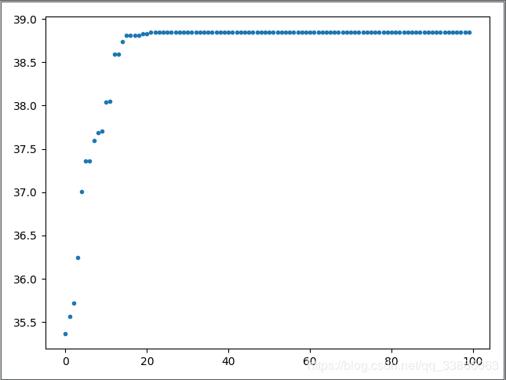

## 遗传算法第一题

历时n天的第一个程序终于结束了！虽然是仿照同学的写的，不过前前后后时间算起来三四周有好几整天都在这道题上。现在终于跑出结果，还是有很多收获的。给自己一个大拇指👍【黄老师说了，搞科研要沉下来】

> 1. python的一些基本用法熟悉了
> 2. GA的基本思想也熟悉了

Q：代码完成后存在的问题就是收敛速度过快，而且无论进化多少代都找不到最优解。
A：需要考虑到参数选择问题，种群的规模N，交叉概率Pc，变异概率Pm，算法终止条件（进化代数）。
1. N取值较小，可以提高运算速度，但是影响了种群的多样性，容易引起算法早熟。【对，我初始化是10忘记改了，结果收敛的特别快】
   N取值较大，提高算法搜索能力，增加算法计算量，降低算法效率。
   一般，20~100
2. 交叉概率Pc，决定了进化过程中种群参与交叉的个体数目。
   Pc较小时发现新个体的速度太慢，Pc较大又会使搜索随机性太大。
   一般，0.4~0.99。自适应的交叉概率最理想。
3. 变异概率Pm，增加种群的多样性。
   Pm较大，算法跳跃性太大；Pm较小，使算法聚焦于特别区域作局部搜索。
   一般，0.4\~1.0【不使用交叉算子的话】；否则，0.0001\~0.5。自适应的变异概率最理想。
4. 终止条件，事先指定代数，可以在给定时限内找到相对满意解，但不一定找得到最优解。
   可以根据很长时间内最优解没有变化来终止算法。

以下是详细的题目要求、解答步骤以及代码：
```python
"""
题目：
    max f(x1,x2) = 21.5 + x1 sin(4 PI x1) + x2 sin(20 PI x2)
    s.t.
    x1∈[-3.0, 12.1]
    x2∈[4.1, 5.8]
    E = 10^-4
解决：遗传算法
    1. 初始化种群:计算基因位数，生成初始个体，确定种群规模N，生成初始种群P，设置代数t=0
        二进制编码长度计算公式：(b - a) / 10^α + 1 ≤2^m
        math.log(num,base) base：默认为e; ceil 向上取整，floor 向下取整
        随机数生成方法：
            random.randint(a,b[,c]) : [a,b]的随机整数,c是步幅
            np.random.randint(a,b) : [a,b)前闭后开 (low=?,high=?,size=?,dtype=) size需要是整数或tuple,表示几行几列
            random.uniform(a,b)
    2. 计算个体适应度值，需要解码:y = a + (b - a)*x/(2^m-1),再代入f(x1,x2)中
    3. 轮盘赌选择，需要求出个体适应度比例p,再求出累计适应度区间q,随机生成N个(0,1)之间的数，得到所选择的个体编号
    4. 交叉，需要交叉算子pc，随机生成N/2个(0,1)之间的数，小于等于pc就交叉；
        父代个体通过两点交叉，生成两个(0，31)随机数作为交叉点，交换中间的gene得到两个子代个体
    5. 变异，对交叉产生的m个后代，随机生成m*33个(0,1)的随机数，判断变异位置进行变异
    6. 计算后代的适应度值，从generation∪offspring1∪offspring2中选N个，选出E个最好的直接保留到下一代，再从剩余中选出N-E个轮盘赌-->得到next_generation
"""
import math
import random
import heapq
import time
import matplotlib.pyplot as plt

start = time.time()

# ----------------------------初始化定义变量-------------------------
x1_left = -3.0  # x1，x2变量的范围
x1_right = 12.1
x2_left = 4.1
x2_right = 5.8
precision = 10 ** -4  # 精度要求
pc = 0.6  # 交叉概率
pm = 0.01  # 变异概率
N = 100  # 种群规模
T = 100  # 种群代数
E = int(N / 5)  # 精英保留数
ax = []	# plt的横坐标
ay = [] # plt的纵坐标


# -----------------------------计算编码位数---------------------------
def count_code_gene():
    x1_len = math.ceil(math.log((x1_right - x1_left) / precision + 1, 2))  # 18
    x2_len = math.ceil(math.log((x2_right - x2_left) / precision + 1, 2))  # 15
    # print(x1_len, x2_len)
    gene_length = x1_len + x2_len
    return x1_len, x2_len, gene_length


# ---------生成随机个体，编码[input:编码位数，output:个体gene]--------
def create_random_individual():
    gene_str = ''
    for i in range(gene_length):
        gene_str += str(random.randint(0, 1))
    # print(isinstance(gene_str,str))
    return gene_str


# ------初始化种群;input:种群规模，gene个数，output:初始种群-----------
def init_generation(population_size):
    next_generation = []
    for i in range(population_size):
        next_generation.append(create_random_individual())
    # print('初始化种群：', next_generation)
    return next_generation


# ----个体解码,input:个体和两变量长度，output:解码后的两个变量值--------
def decode(gene_str):
    x1 = int(gene_str[:x1_len], 2)
    x2 = int(gene_str[x1_len:], 2)
    x1 = x1_left + (x1_right - x1_left) * x1 / (2 ** x1_len - 1)
    x2 = x2_left + (x2_right - x2_left) * x2 / (2 ** x2_len - 1)
    # print('解码：', x1, x2)
    return x1, x2


# --------------------------目标函数------------------------------------
def fitness(x1, x2):
    return 21.5 + x1 * math.sin(4 * math.pi * x1) + x2 * math.sin(20 * math.pi * x2)


# --------计算个体适应度值;[input:种群，output:适应度list]--------------
def adaption(generation, count):
    # x1_len, x2_len = count_code_gene()[:2]
    individual = []  # x1,x2
    fit = []  # 个体的适应度值
    proportion = []  # 个体适应度值占比
    for i in range(count):
        # print('个体： ', generation[i])
        x1, x2 = decode(generation[i])
        individual.append([x1, x2])
        fit.append(fitness(x1, x2))
    for i in range(count):
        proportion.append(fit[i] / sum(fit))
    return fit, proportion, individual


# -------轮盘赌选择m个算法[input:proportion，output:所选择的个体]-------
def roulette(proportion, count):
    q = []  # 累计适应度
    select = []  # 最终选出来的个体编号
    for i in range(len(proportion)):  # 计算概率累计值个数此处用了count所以错了
        q.append(proportion[i] + sum(proportion[:i]))

    for i in range(count):  # 选count个
        rand = random.uniform(0, 1)  # 生成1个[0,1]随机数
        for j in range(len(q)):
            if rand <= q[j]:
                select.append(j)
                break
    # print("轮盘赌选择的结果：", select)
    return select


# 一次交叉[input:父代两个gene_str，output:子代新的两个gene_str]
def crossover(father, mother):
    a = random.randint(0, gene_length - 1)  # 随机找两个交叉点
    b = random.randint(0, gene_length - 1)
    first = min(a, b)
    second = max(a, b)
    # print('交叉点：', first, second)
    ch1 = father[:first] + mother[first:second] + father[second:]
    ch2 = mother[:first] + father[first:second] + mother[second:]
    return ch1, ch2


# ----------------------------个体变异-------------------------------
# bug:individual是string类型，是一种区别于list的不可变类型，所以不能直接赋值改变某一位的值
# solve:可以直接string转为list
def mutation(individual):
    # print('变异前：', individual)
    individual = list(map(int, individual))  # string ---> list
    for i in range(len(individual)):
        rand = random.uniform(0, 1)
        if rand <= pm:
            individual[i] = 0 if individual[i] == 1 else 1
    individual = ''.join(str(i) for i in individual)  # list ---> string
    # print('变异后：', individual)
    return individual


# -------------------------------进化--------------------------------
# bug:每一代种群的数量不固定，一直在减少
# solve:轮盘赌第一个for循环个数写错了
def evolution(generation, t):
    # 选择出来的N个父代个体进行N/2次交叉产生的N个子代个体，在进行N次变异
    fit, proportion, individual = adaption(generation, len(generation))  # 这一代种群的适应度
    # --------------------------------------------------
    re = list(map(fit.index, heapq.nlargest(1, fit)))  # 选出一个适应度最大的个体
    # print('种群', generation[re[0]])
    # print('x1,x2', round(float(individual[re[0]][0]), 4), round(float(individual[re[0]][1]), 4))
    best = round(float(fit[re[0]]), 4)
    # print('第', t, '代：', best)
    ay.append(best)
    # ---------------------------------------------------
    select = roulette(proportion, len(generation))  # 轮盘赌选择的个体N个

    # 交叉
    rand = []
    for i in range(int(N / 2)):
        rand.append(random.uniform(0, 1))  # N/2个随机数，判断这一对是否可以交叉生成后代
    offspring = []  # 交叉产生的后代
    j = 0
    for i in range(int(N / 2)):
        father = generation[select[j]]
        mother = generation[select[j + 1]]
        if rand[i] <= pc:
            child1, child2 = crossover(father, mother)
            offspring.append(child1)
            offspring.append(child2)
        else:
            offspring.append(father)
            offspring.append(mother)
        j += 2

    # 变异
    offspring1 = []  # 变异后代
    for i in range(len(offspring)):
        child = mutation(offspring[i])
        offspring1.append(child)
    the_generation = generation + offspring + offspring1  # 2N

    # 轮盘赌下一代
    next_generation = []
    if len(offspring1) == 0:
        next_generation = generation
    else:
        fit, prop, indi = adaption(the_generation, len(the_generation))
        # ------------
        re1 = list(map(fit.index, heapq.nlargest(E, fit)))  # 选出适应度最大的E = 1/5N个个体，放到下一代
        for i in range(len(re1)):
            next_generation.append(the_generation[re1[i]])
        select1 = roulette(prop, N - E)  # 轮盘赌选择，选出N - E个个体，放入下一代
        for i in range(len(select1)):
            next_generation.append(the_generation[select1[i]])
        # -------------
    return next_generation


# -------------------------------主函数------------------------------
if __name__ == '__main__':
    x1_len, x2_len, gene_length = count_code_gene()  # 获取长度
    generation1 = init_generation(N)  # 获取第一代种群
    for i in range(T):  # 进化T代
        ax.append(i)
        generation1 = evolution(generation1, i)

    end = time.time()
    print('运行时间：', end - start)
    plt.plot(ax, ay, '.')
    plt.show()
'''
bug:从10几代开始，每一代交叉之后的个体显示与上一代是一样的，差集为空
explanation：说明交叉函数，变异函数没有正确执行
solve：找了很久，发现变异的最关键的gene编译部分的空格错位，python是严格要求每一行语句的先后关系的

找bug时的一些注释
B = set(generation).difference(set(offspring))
# print('这一次进化交叉几次：', jiaocahcishu)
C = set(generation).difference(set(offspring1)) # 求差集
D = set(offspring).difference(set(offspring1))
A = set(generation).difference(set(next_generation))
print('cross', len(B), B)
print('mutation', len(C), C)
print('select', len(A), A)
print('mutation-crossover：', len(D), D)
'''
```
因为存在随机性，所以每一次的结果都会有不同，也可能进化不到最优解。但这种简单问题100代足够了。
```python
第 0 代： 35.3653
第 1 代： 35.5684
第 2 代： 35.7218
第 3 代： 36.2476
第 4 代： 37.0069
第 5 代： 37.3647
第 6 代： 37.3647
第 7 代： 37.5993
第 8 代： 37.6885
第 9 代： 37.7033
第 10 代： 38.0395
第 11 代： 38.0491
第 12 代： 38.596
第 13 代： 38.596
第 14 代： 38.7412
第 15 代： 38.8096
第 16 代： 38.8096
第 17 代： 38.8096
第 18 代： 38.8097
第 19 代： 38.8269
第 20 代： 38.8269
第 21 代： 38.846
第 22 代： 38.846
第 23 代： 38.846
第 24 代： 38.8481
第 25 代： 38.8481
第 26 代： 38.8481
第 27 代： 38.8493
第 28 代： 38.8493
第 29 代： 38.85
第 30 代： 38.85
第 31 代： 38.85
第 32 代： 38.8502
第 33 代： 38.8502
第 34 代： 38.8502
第 35 代： 38.8502
第 36 代： 38.8503
第 37 代： 38.8503
第 38 代： 38.8503
第 39 代： 38.8503
第 40 代： 38.8503
第 41 代： 38.8503
第 42 代： 38.8503
第 43 代： 38.8503
第 44 代： 38.8503
第 45 代： 38.8503
第 46 代： 38.8503
第 47 代： 38.8503
第 48 代： 38.8503
第 49 代： 38.8503
第 50 代： 38.8503
第 51 代： 38.8503
第 52 代： 38.8503
第 53 代： 38.8503
第 54 代： 38.8503
第 55 代： 38.8503
第 56 代： 38.8503
第 57 代： 38.8503
第 58 代： 38.8503
第 59 代： 38.8503
第 60 代： 38.8503
第 61 代： 38.8503
第 62 代： 38.8503
第 63 代： 38.8503
第 64 代： 38.8503
第 65 代： 38.8503
第 66 代： 38.8503
第 67 代： 38.8503
第 68 代： 38.8503
第 69 代： 38.8503
第 70 代： 38.8503
第 71 代： 38.8503
第 72 代： 38.8503
第 73 代： 38.8503
第 74 代： 38.8503
第 75 代： 38.8503
第 76 代： 38.8503
第 77 代： 38.8503
第 78 代： 38.8503
第 79 代： 38.8503
第 80 代： 38.8503
第 81 代： 38.8503
第 82 代： 38.8503
第 83 代： 38.8503
第 84 代： 38.8503
第 85 代： 38.8503
第 86 代： 38.8503
第 87 代： 38.8503
第 88 代： 38.8503
第 89 代： 38.8503
第 90 代： 38.8503
第 91 代： 38.8503
第 92 代： 38.8503
第 93 代： 38.8503
第 94 代： 38.8503
第 95 代： 38.8503
第 96 代： 38.8503
第 97 代： 38.8503
第 98 代： 38.8503
第 99 代： 38.8503
运行时间： 0.6995866298675537
```


```
max f(x1,x2) = 100*(x2-x1^2)^2+(1-x1)^2
    s.t.    x1,x2∈[-2.048, 2.048]
            E = 10^-4
最优解：3905.9262
```

