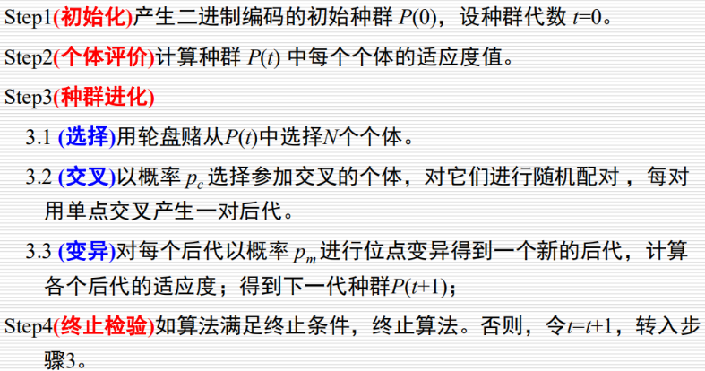

###经典遗传算法：

1. 通过自变量的范围求出所需要的编码位数
2. 编码，随机生成10×33的矩阵--->初始种群
3. 切分，10×18和10×15的矩阵【或许不用切分】；逐行转十进制，带入解码公式，生成x1,x2
4. 代入适应度函数，求取每一个个体的适用度fi
5. 求出fsum,算出每一个个体占总适用度的比例pi，然后计算qi【概率分段区间】
6. 随机生成N个[0,1]的随机数，查看所在分段区间的位置【轮盘赌选择】
7. 生成N/2个随机数，<Pc的开始两点交叉【从33个gene中找到两个点，交换中间部分】
8. 生成m*33个随机数，对于≤Pm的gene位反转
9. 计算后代的适用度，选出最好的E个
10. 使用轮盘赌选择其中的N-E个
11. 年代数+1，进入循环