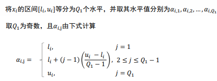

## OGA/Q

1. OGA/Q：离散化正交遗传算法（orthogonal genetic algorithm with quantization）

2. 两大创新：在GA的init_population和交叉算子中运用了离散化和正交设计技术。

3. 正交设计： N 个因素和 Q 个水平会产生 $Q^N$ 个组合方案，当 N 和 Q 很大时，可能 没办法做$ Q^N $个实验。因此需要找到数量较少且有代表性的组合。 

   要将N个属性的每一种组合都测试一遍，需要$Q^N$种组合（每一个属性都有Q种取值）。

   factor：对于目标的影响因素N

   level：每一个factor的不同取值QN

   $L_M(Q^N) = [a_{ij}]_{M×N}$

   M是选取的组合数。

4. $a_{ij}$表示什么？

   $[a_{ij}]_{M×N}$表示一个M行N列的矩阵，也就是M条测试数据，每一列对应的都是当前属性组合中属性的取值。$a_{ij}$就表示，在第i个组合中的第j个属性的取值。

5. 正交矩阵的五条性质：

   - 对于任意一列，每一个水平出现$\frac{M}{Q}$次。【一共M个组合，一列表示一个属性，该属性的水平数是Q】
   - 对于任何两列，有M个包含如下水平的组合(1,1),(1,2),...,(1,Q),...(2,Q),...,(Q,Q)【M个组合中，一定满足两两属性的所有组合情况】
   - 对于任何两列，两种水平的每个组合出现$\frac{M}{Q^2}$次。
   - 如果一个正交设计矩阵的任何两列交换，仍然是一个正交设计矩阵。
   - 如果正交矩阵去除掉某些列，则去掉的矩阵仍然对应着一个因素较少的正交设计矩阵。

6. 有M个变量，Q个水平，如何生成正交矩阵？

   要求Q是奇数，$M=q^J$，J是满足$N=\frac{Q^J-1}{Q-1}$的正整数。

   基本列:非基本列

7. 找不到满足以上等式的J该如何？

   - $N<=\frac{Q^J-1}{Q-1}$得出J
   - $N'=\frac{Q^J-1}{Q-1}$
   - 得出$L_M(Q^{N'})$
   - 用上面的矩阵减去$N-N'$个列，得到$L_{Q^{J_1}}(Q^{N'})$

8. 针对离散变量，连续变量需要将连续性变量离散化。

   如何离散化?

   将每一个factor离散为Q个level，

   

9. 如何用正交矩阵初始化种群？

10. 如何划分子空间？何时需要划分？

11. 如何在交叉算子中运用正交矩阵生成后代？