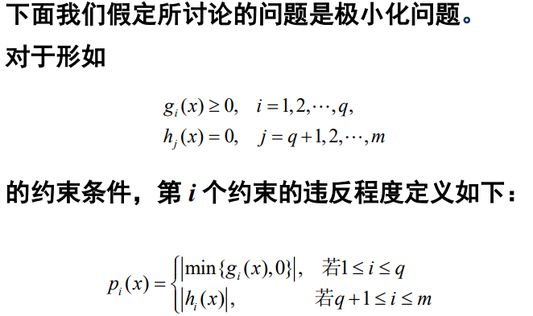
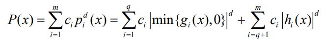
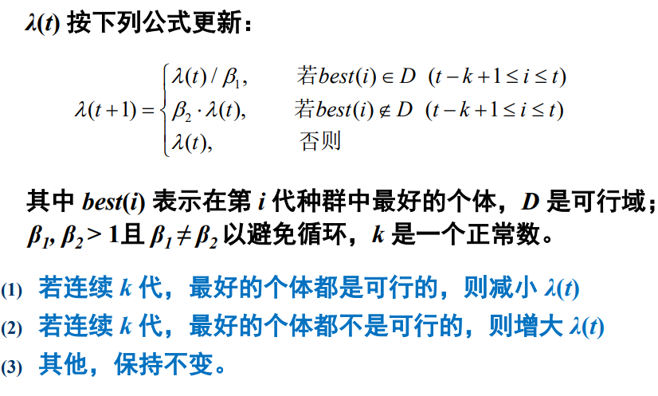

###  无约束优化

没有任何约束的情况下求目标函数的极大值或极小值。

可描述为：

min/max f(x) 

s.t. 	$x\in$S  其中S是搜索空间

#### 两点间连线上的点

已知两个点，要求两点连线上点的坐标。

从一维坐标开始考虑，即x轴上的点，A：a，B：b，两点中间的点C可以表示为：$\lambda{a}+(1-\lambda){b}$，$\lambda\in$[0,1]

延伸到二维坐标，A(x1,y1)，B(x2,y2)，两点间连线可以表示为：$\lambda{A}+(1-\lambda)B$，

即其中任意一点坐标的坐标C($\lambda{x_1}+(1-\lambda){y_1}$，$\lambda{x_2}+(1-\lambda){y_2}$)

按此规律可以拓展到更高维度。

### 约束优化问题

可以描述为：

min f(x) 

s.t.  $g_i(x) >= 0, i = 1,2,...,q$

​		$h_i(x) = 0,i = q+1,...,m$		

​		$x\in$S  其中S是搜索空间

可能有等式约束，也可能有不等式约束。

处理这种问题的办法：

- 拒绝法：抛弃进化过程中所有不可行的个体（不符合约束的）
- 修正法：通过一个修正因子对不可行个体进行修复，使之成为课程个体。
- 罚函数法：

$eg:$ 背包问题：将个体基因位为1的物品按照价格/重量这个物品的密度重大到小排序，知道背包装不下为止，将剩下的标记成0。

### 罚函数

 罚函数法：通过对目标函数加上一个惩罚项构成的广义目标函数，可以将约束优化问题转化为无约束优化问题，使得进化算法在惩罚项的作用下得到原问题的最优解。

给目标函数加上一个罚函数得到新的目标函数，F(x) = f(x) + P(x)。

对可行解P(x)=0，也就是不惩罚；对不可行解，P(x)>0

静态罚函数：P(x)越大，x违反程度越大

👽罚函数过大:太注重可行解,导致及早收敛到可行解.

👽罚函数过小:在非可行域浪费太多时间,收敛到不可行域.

💮自适应罚函数:给每一代的罚函数成一个年代因子,起处影响较大,到快收敛的时候该因子变小.$P(x) = \lambda(t) \sum^m_{i=1}p_i^2(x) $

1. 一般的罚函数模型中将**适应度**定义为**目标函数**和**罚函数**的和，存在的问题:

- 罚因子不好确定

- f(x)和p(x)的差值过大时,无法区分可行解和不可行解，所以不能有效地处理约束

2. 作者的改进:目标满意度$f_i(x)$和约束满意度$p_i(x)$.

   $f_i(x)=\frac{f_{max}-f(x)}{f_{max}-f_{min}}$

   $p_i(x)=\frac{p_{max}-p(x)}{p_{max}-p_{min}}$

   适应度F(x)：$F(x) = f_i(x)*p_i(x)^{\frac{m}{N}\frac{2t-1}{t}}$

   m代表不可行解的个数，如果不可行解所占比重大，那么惩罚力度就大；反之，减小惩罚力度。

   惩罚力度随着t的增大应该加强：进化初期需要保留比较多的不可行解来保证种群的多样性，进化后期就需要尽可能地保留可行解。

3. 改进交叉算子

   从父代个体中选择一个最好的，再随机选择两个父代个体，由这三个点构成的三角形中随机产生后代。

   这三者之间的比例也是由三个随机数构成的。

   $Offspring = \frac{r1}{r1+r2+r3}father+\frac{r2}{r1+r2+r3}mother+\frac{r3}{r1+r2+r3}the\_best$

4. 变异算子

   $if:r3<0.5 \space \hat{x}_i=x_i+\frac{u_i-l_i}{t}$

   $else:\hat{x}_i=x_i-\frac{u_i-l_i}{t}$

   $u_i-l_i$是x的取值范围，t为年代