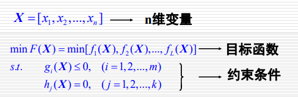

### 多目标优化问题：

问题存在多个目标，并且这些目标都是相互冲突、相互竞争的，往往不可能找到同时满足两者的最优的解，需要折衷协调两个目标的重要程度。

寻找一组有代表性的解，让决策者根据偏好确定的那个可接受的解。

- MOP问题中，如何判断两个解的优劣程度？
- 设p,q是该问题的两个解，如果对于所有的子目标，p不必q差，并且至少存在一个目标p比q要好，那么p就比q要好。

Perato最优解   perato Front(PF)  priori先验   posterior 后验

单目标优化：要在可行域内找到一个最好的解。

多目标优化：要在可行域内找到一组有代表性的非支配解，需要足够接近PF，并且尽可能分布比较均匀，范围宽

加权求和法：通过给多个目标函数加权，将多目标优化转变为单目标问题。

NSGA-II：锦标赛选择

等级种群：非支配排序，拥挤度排序

根据非支配排序，每一个解都会有一个属于的等级

非支配排序：

- 首先对每一个解$i$计算支配解的数量$n_i$和i所支配的解的集合$s_i$
- 然后将$n_i=0$的解放入F1中，称F1为当前非支配解，等级为1。
- 将F1中每一个解所对应的$s_i$中个体j的$n_j$减一，如果$n_j=0$，就将该点放入F2中，等级为2.
- 依次类推，将所有的解分类。

拥挤度排序：计算没一点与同等级相邻点之间的局部拥挤距离，使得Perato解集分布比较均匀。如点A的左右两侧相邻点为B(x1,y1)，C(x2,y2)，A的拥挤度为：distance=(y2-y1)+(x2-x1)

如何比较两个解的优劣:

- 先比较rank，rank越小的个体越好
- rank一样的，distance越大的个体越好

