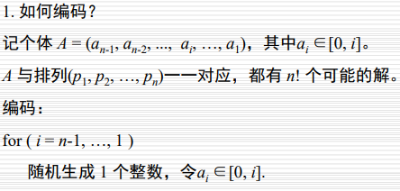
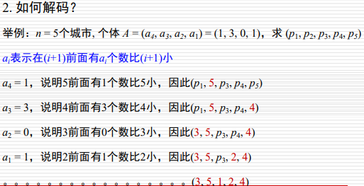
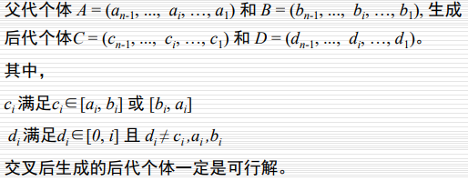
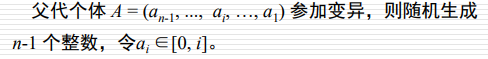
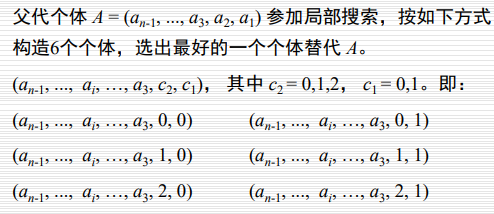

1. 

2. 进化算法相较于传统算法有何优点？

   - 进化算法是一群点同时搜索，可以找到问题的最优解
   - 函数导数不存在或者不容易求解时，进化算法能比较好的求得全局最优解。

3. $x\in$[-1.0, 5.6]，$e$ = 0.0001，写出编码位数m和解码公式。

   - m = 17
   - 转为十进制x = Σxibi ，y = -1.0 + 6.6 * (x / 217-1)

4. 轮盘赌选择的思想和步骤：

   思想：

   - 为群体中每个个体指定饼图中一个小块。块的大小与 个体的适应度成比例，适应度愈高，它在饼图中对应 的小块所占面积也愈大。为了选取一个个体，要做的 就是旋转这个轮子，直到轮盘停止时，看指针停止在哪一块上，就选中与它对应的那个个体。 

   步骤：

   - 计算种群中个体的适应度值
   - 计算种群每一个个体的适用度比例，也就是选择概率pi
   - 计算每个个体的概率累加值qi
   - 产生r个[0, 1]之间的随机数
   - 若qk-1 < r <= qk，就选择第k个个体
   - 重复上两步，知道获得足够的个体

5. 种群规模是N = 20，适应度函数f(x$i$) = $i$（$i\in$[1,20]），用轮盘赌选择20个去交叉，X20未被选中的概率：

   解：fit(20) = 20

   ​		P20 = fit(20)/Σfit(i) = 20 / (1+......+ 20) = 2/21

   ​		未被选中的概率就是每一次都选不中：P = （1 - P20）20 = (19/21) 20

   ​		等差数列求和公式： Sn=n*a1+n(n-1)d/2=n(a1+an)/2 

6. 罚函数法的思想：

  在原来的目标函数基础上添加一个罚函数，构成广义目标函数，通过罚函数的惩罚作用可以将约束问题转为无约束问题，使得遗传算法更容易找到最优解。

7. 多目标优化问题如何比较两个解的优劣关系？

  设p，q是问题的两个解，如果满足以下两个条件，我们就称p支配q，也就是p比q要好：

  - 对于所有的子目标，p不比q差。
  - 至少存在一个子目标，使p比q好。

8. NSGA-II如何对种群中的个体排序？

  先分层后比较拥挤度

9. 进化算法以概率1收敛到最优解的条件：

  - 任意个体a和b，a经过交叉、变异可达b
  - 种群有单调性，也就是选择策略中含精英保留

10. N个城市的TSP问题，设计编码策略、交叉、变异算子和局部搜索，要求N个交叉后代为可行解。

  - 编码：整数编码方式，可选择近邻表示法，将一条路线表示成n个城市的一个排列$a_1,a_2,...,a_n$，其中$a_i$表示城市i到达的下一个城市为$a_i$。

    

  - 交叉：两点交叉

    

  - 变异：移位变异

    

  - 局部搜索：父代个体A参加局部搜索，在个体很小的变动范围以内找到最优解。

    

11. N个物品的背包问题，背包的总容量是M，N个物品的体积、价格分别是wi，ci，设计编码策略、交叉变异算子、修正算子，满足个体满足约束的所有条件。

   背包问题【混合遗传算法 = GA + 贪心】

   物品个数m，背包最大承重V，每个物品的价格c，重量w

   s.t. Σwixi < V

   - 编码：随机生成长度为m的01字符串，01分别表示该item取还是不取
   - 适应度函数：编码的每一位乘上$x$i所对应的c得到该个体的总价格。
   - 交叉算子：两点交叉，随机找两个点，交换随机点中间的基因位。
   - 变异算子：移位变异，随机找一个点放到最前面
   - 修正算子：计算每一个item的密度，c/v，将个体中基因位是1的item放到一个优先队列中，截止到包能放下的最大重量V之前，将其后的元素全部置为 0，也就是不取这些元素。

12. 设一个个体的最大深度是D，用生长法生成个体时，若果函数是二元函数，且从函数集F和从端点集T中选择结点的概率是50%，求生成的个体是满二叉树的概率？

   - 满二叉树的概率：树根必须从F中选择，概率为1；从第2层到第i层（i<D），每一种情况都需要$\sum_{i=2}^{D-1}{\frac{1}{2}}^{2^i-2}+{\frac{1}{2}}^{2^{D-1}-2}$

13. GP，F={+,-,*,/}，T={x,y,z}，N=18，最大深度是4，画出混合法生成的个体。

   - 混合法：从深度为2~4，每一种深度用生长法和完全法各一半，也就是深度有3种，每一种的每一个方法生成3棵树。
   - 完全法生长的一定是一颗满二叉树，最后一层节点是T中的点，其余的一定是F中的点。
   - 生长法的根节点肯定是F中的某一个点，从第2层开始到D-1层从$T \cup F$中选，如果某个子结点选择了T中的结点，那么它只能是叶子节点。到最后一层的时候，只能从T中选。

14. 正交矩阵的特点：$L_M(Q^N)=[a_{ij}]_{MN}$

