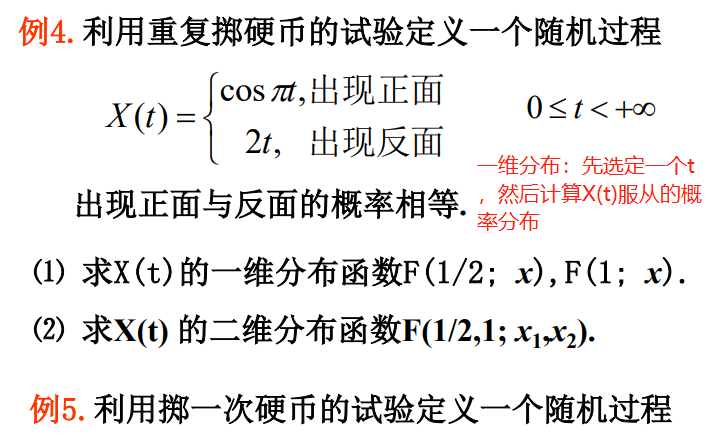
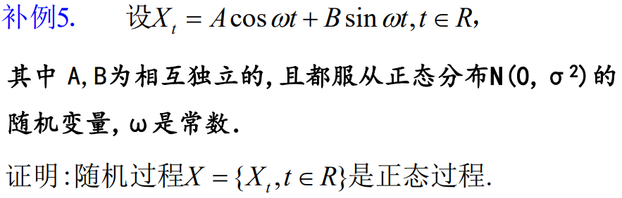
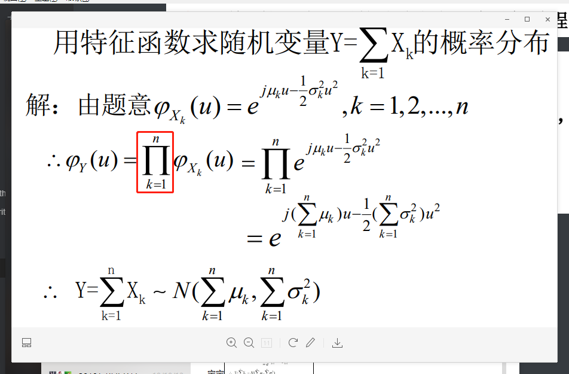

求SP的一维分布，X(t) 是一个参数为t的随机过程，一般题目中会给出一个X(t)的式子，其中包含t和已知分布的随机变量。

要求其一维分布，就设一个t，然后按照已知分布的随机变量来求解X(t)的分布函数。

要求其二维分布，就设两个t.

例如，X(t) = A + tB，A，B~N(0，1)，要求X(t)的分布，只需要求出X(t)的均值和方差就可以了，带入高斯分布的式子即可

首先，计算Xt的均值和方差，

宝宝

