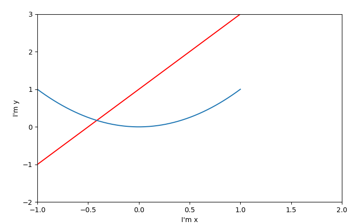
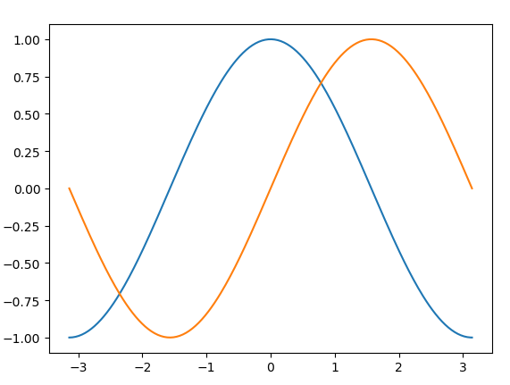
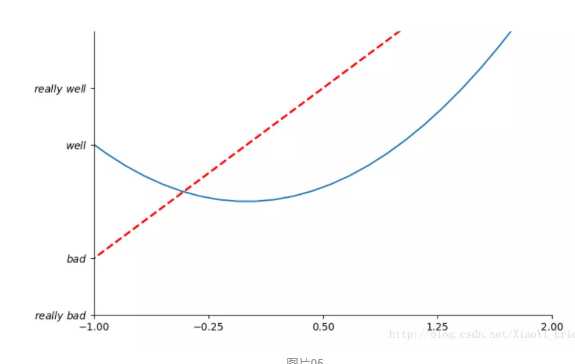
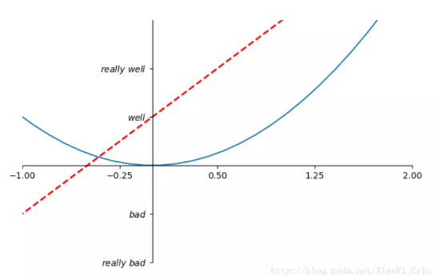
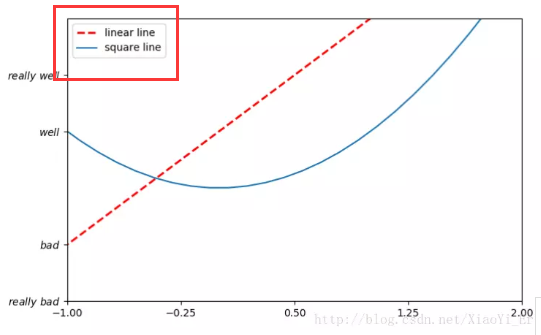

## matplotlib常用函数：

[摘自](https://www.cnblogs.com/limitlessun/p/8489749.html#_label2)

- 一般使用如下语句导入:import matplotlib.pyplot as plt
- 绘图:[plt.plot(x,y)](https://matplotlib.org/api/_as_gen/matplotlib.pyplot.plot.html#matplotlib.pyplot.plot),可选color,marker,label等参数,默认的x坐标为从0开始且与y长度相同的数组,x坐标与y坐标一般使用numpy数组,也可以用列表
- 设置线条:[plt.setp()](https://matplotlib.org/api/_as_gen/matplotlib.pyplot.setp.html#matplotlib.pyplot.setp)
- 轴名称:plt.xlable('str'),plt.ylable('str)
- 添加文本:plt.txt(xpos,ypos,'str')
- 添加格子:plt.grid(True)
- 展示图片:plt.show()
- 图题:plt.title('str')
- 图示:plt.legend(),结合plot()中的label参数使用
- 获取子图:plt.sublot(nrows,ncols,index)或plt.subplot2grid((nrows,ncols),(rows,cols)),可选colspan和rowspan属性
- 创建画布:plt.figure()
- 数学表达式:[TeX表达式](https://matplotlib.org/users/mathtext.html#mathtext-tutorial)
- 非线性轴:plt.xscale('scale'),plt.yscale('scale'),可选参数log,symlog,logit等
- 填充颜色:plt.fill(x,y)和plt.fill_between(x,y,where=...)
- 条形图:plt.bar(x,y),注意多个条形图的默认颜色相同,应选择不同的颜色方便区分
- 直方图:plt.hist(x,bins),直方图是一种显示区段内数据数量的图像,x为数据,bins为数据区段,可选histtype,rwidth等属性
- 散点图:plt.scatter(x,y),散点图通常用于寻找相关性或分组,可选color,marker,label等属性
- 堆叠图:plt.stackplot(x,y1,y2,y3...),堆叠图用于显示部分对整体随时间的关系,通过利用plt.plot([],[],color,label)添加与堆叠图中颜色相同的空行,可以使堆叠图的意义更加清晰,可选colors等属性
- 饼图:plt.pie(slice),饼图用于显示部分对整体的关系,可选labels,colors,explode,autupct等属性

x = numpy.linspace(-1,1,50)  --->样本范围，start，end，样本数[【详细】](onenote:#numpy.linspace&section-id={2C0D71B8-0D06-4DD0-BC69-3B33DBF4D5A5}&page-id={E1537C6B-41FA-4F77-9ECD-5D2A3901FDE3}&end&base-path=https://d.docs.live.net/b474b7e27a180c3d/Documents/机器学习/python3.one)

y = 2*x+1

plt.figure()   --->创建画布

plt.plot(x,y,color='red',linewidth=2,linestyle='--')   ---> 横纵坐标，描线风格

# 例子1

```python
>>>y1=2*x+1
>>>y2=x**2
>>>plb.figure(num=2,figsize=(8,5))
<Figuresize800x500with0Axes>
>>>plb.plot(x,y1,color='red',linestyle='-')
[<matplotlib.lines.Line2Dobjectat0x0000018F9B23C240>]
>>>plb.plot(x,y2)          描点
[<matplotlib.lines.Line2Dobjectat0x0000018F9B23CA20>]
>>>plb.xlim(-1,2)          指定x轴范围
(-1,2)
>>>plb.ylim(-2,3)         指定y轴范围
(-2,3)
>>>plb.xlabel("I'mx")      指定x轴标签内容
Text(0.5,0,"I'mx")
>>>plb.ylabel("I'my")    指定y轴标签内容
Text(0,0.5,"I'my")
>>>plb.show()
```



# 例子2

```python
>>>from pylab import * 

>>>import numpy as np

>>>x=np.linspace(-np.pi,np.pi,256,endpoint=True)

>>>c,s=np.cos(x),np.sin(x)

>>>plot(x,c)

[<matplotlib.lines.Line2Dobjectat0x0000028AB30ABFD0>]

>>>plot(x,s)

[<matplotlib.lines.Line2Dobjectat0x0000028AB8295E48>]

>>>show()
```




# 详细配置介绍

```python
# 创建一个 8 * 6 点（point）的图，并设置分辨率为 80

figure(figsize=(8,6), dpi=80)

# 创建一个新的 1 * 1 的子图，接下来的图样绘制在其中的第 1 块（也是唯一的一块）

subplot(1,1,1)

X = np.linspace(-np.pi, np.pi, 256,endpoint=True)

C,S = np.cos(X), np.sin(X)

# 绘制余弦曲线，使用蓝色的、连续的、宽度为 1 （像素）的线条

plot(X, C, color="blue", linewidth=1.0, linestyle="-")

# 绘制正弦曲线，使用绿色的、连续的、宽度为 1 （像素）的线条

plot(X, S, color="green", linewidth=1.0, linestyle="-")

# 设置横轴的上下限

xlim(-4.0,4.0)

# 设置横轴记号

xticks(np.linspace(-4,4,9,endpoint=True)

# 设置纵轴的上下限

ylim(-1.0,1.0)

# 设置纵轴记号

yticks(np.linspace(-1,1,5,endpoint=True))

# 以分辨率 72 来保存图片

# savefig("exercice_2.png",dpi=72)

# 在屏幕上显示

show()
```


# 自定义坐标轴

new_ticks=np.linspace(-1,2,5)#小标从-1到2分为5个单位
 print(new_ticks)
 \#[-1.   -0.25  0.5   1.25  2.  ]
 plt.xticks(new_ticks)#进行替换新下标
 plt.yticks([-2,-1,1,2,], [r'$really\ bad$','$bad$','$well$','$really\ well$'])

# 边框属性

ax=plt.gca()#gca=get current axis
 ax.spines['right'].set_color('none')#边框属性设置为none 不显示
 ax.spines['top'].set_color('none')



# 移动坐标轴中心位置

\#使用xaxis.set_ticks_position设置x坐标刻度数字或名称的位置 所有属性为top、bottom、both、default、none

ax.xaxis.set_ticks_position('bottom')

\#使用.spines设置边框x轴；使用.set_position设置边框位置，y=0位置 位置所有属性有outward、axes、data

ax.spines['bottom'].set_position(('data', 0))
 ax.yaxis.set_ticks_position('left')
 ax.spines['left'].set_position(('data',0))#坐标中心点在(0,0)位置



# 添加图例

x=np.linspace(-3,3,50)
 y1=2*x+1
 y2=x**2
 plt.figure(num=2,figsize=(8,5))
 plt.xlim(-1,2)
 plt.ylim(-2,3)
 new_ticks=np.linspace(-1,2,5)#小标从-1到2分为5个单位
 plt.xticks(new_ticks)#进行替换新下标
 plt.yticks([-2,-1,1,2,],
            [r'$really\ bad$','$bad$','$well$','$really\ well$'])

l1,=plt.plot(x,y1,color='red',linewidth=2,linestyle='--',label='linear line')
 l2,=plt.plot(x,y2,label='square line')#进行画图
 plt.legend(loc='best')#显示在最好的位置
 plt.show()#显示图



```
参数349的意思是：将画布分割成3行4列，图像画在从左到右从上到下的第9块
```