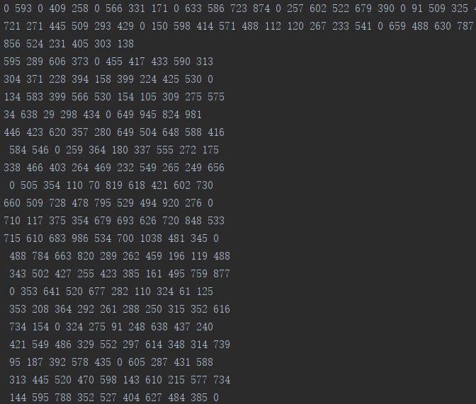
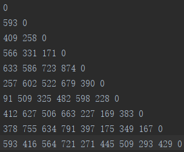

gr48是TSP问题的典型测试数据集，该数据集是一个下三角矩阵，每一个元素代表对应坐标城市i->j的距离，那么现在要做的就是读取文件read()，按照空格分开形成一个一维向量，然后按照数量关系存到一个二维矩阵中，处理方法如下：



一开始拿到数据集，完全不明白乱七八糟的一堆是什么，后来才知道是一个下三角矩阵，再后来才发现可以变成这样：



突然觉得发现了新天地。

我参考的代码用的是pandas，逐行读取，可我这数据有点乱呐。最后我还是直接文件读取，用numpy进行数组的处理。以下是我费了好大功夫研究出来的数据处理的超级超级简单的代码。

```python
 Dist = np.zeros((CityNum, CityNum))
 with open(datapath) as file:
    data = np.array(file.read().split())
    count = 0
    print(len(data))
    for i in range(10):
        for j in range(10):
            if data[count] == '0':
                Dist[i, j] = data[count]
                count += 1
                break
            else:
                Dist[i, j] = data[count]
                count += 1
```

<font color=blue size=4>可能下面判断的部分还可以优化，如果大佬看到了这篇文章，请挽救一下我这只贼笨的小菜鸡！！</font>