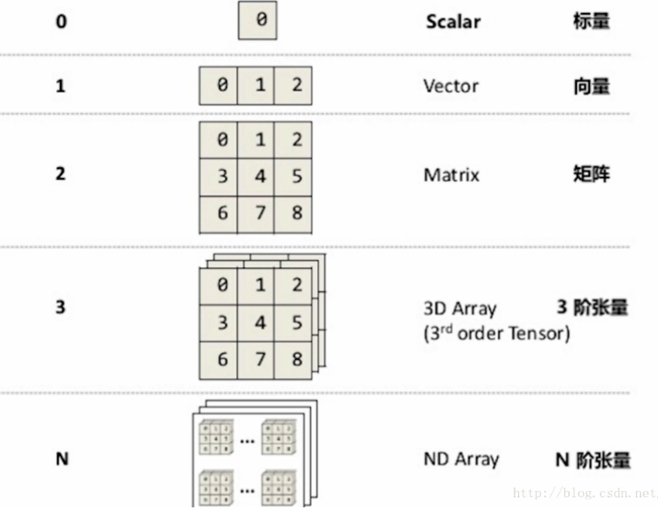

## PyTorch

PyTorch 是 Torch 在 Python 上的衍生. 因为 Torch 是一个使用 Lua 语言的神经网络库, Torch 很好用, 但是 Lua 又不是特别流行, 所有开发团队将 Lua 的 Torch 移植到了更流行的语言。

tensorflow是一个静态的搭建流程图，tensor是tensorflow基础的一个概念——张量。Tensorflow用到了数据流图，数据流图包括数据（Data）、流（Flow）、图（Graph）。Tensorflow里的数据用到的都是tensor，所以谷歌起名为tensorflow。

PyTorch是一个动态的。。

 PyTorch 说他就是在神经网络领域可以用来替换 numpy 的模块.