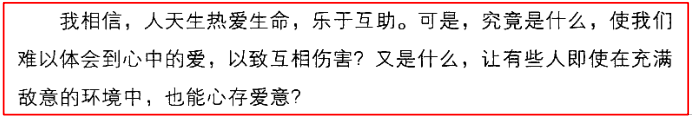
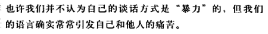
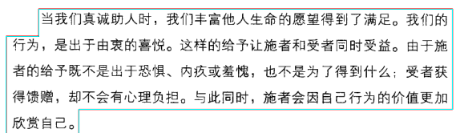
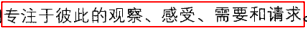

###第〇壹天

谈话方式也能暴力？没错，e.g.冷言冷语



```
究竟是什么呢？什么是爱？如何得到爱？如何给予爱？爱在心里
```

艾提海勒申在德国集中营，


```
对，很多无意识的话最伤人。可能很准确地表达了你此时的心情，但是也很大程度的伤害了别人。我想作者的意图是，人之初，性本善，我们要非暴力沟通，对他人友好。
```

- 注意说话方式，即使在逆境，也要有爱，使爱融入生活。
- 仔细聆听别人说啥，不要反射性猜测



```
很独特的见解，这便是爱吧！让人羡慕让人倾心

很多人终将因为语言的暴力，使自己的想法与实际的到的效果背道而驰

而现在，我意识到，很多时候是我自己觉得自己帮助的人不友善，所以有些表现就与初心背离，下意识就会用一些奇怪的表情动作或者语言，不想那么恭恭敬敬，用自己的真心换来一盆冷水。
下面作者又提到了，不能期待自己沟通的对象懂得非暴力，我们要心存善意，乐于互助，终会改变局面。
```

沟通四要素：

- 我的观察，不判断不评论
- 我的感受、心情
- 什么原因导致这样的感受【我的性格，我的习惯，......】
- 为了改善，我需要你怎么做

这种沟通方式应用于各种场景，可以改善一切需要你交际的环境中。说话不要always拐弯抹角或是旁敲侧击，学着成长、接纳、爱。



非暴力沟通不仅仅局限于语言和文字的技巧，页包含意识和意图，通过动作、表情、沉默、认真等等来体现。